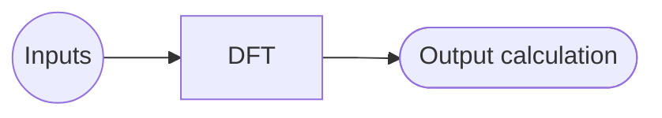
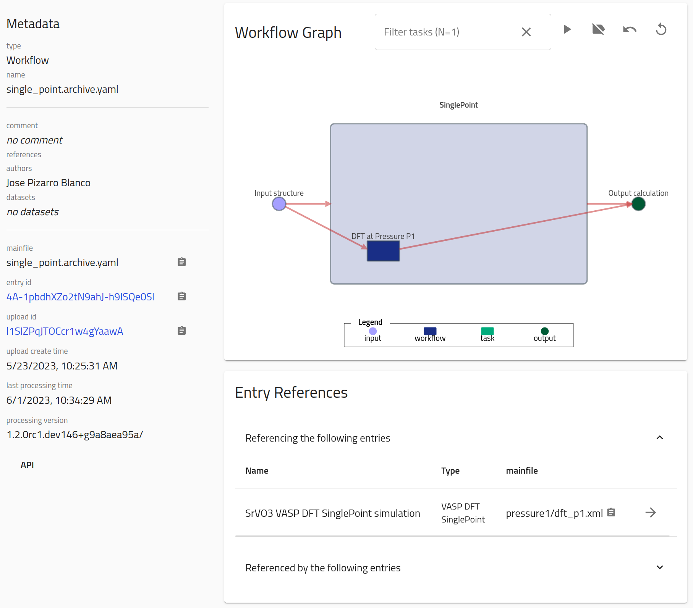
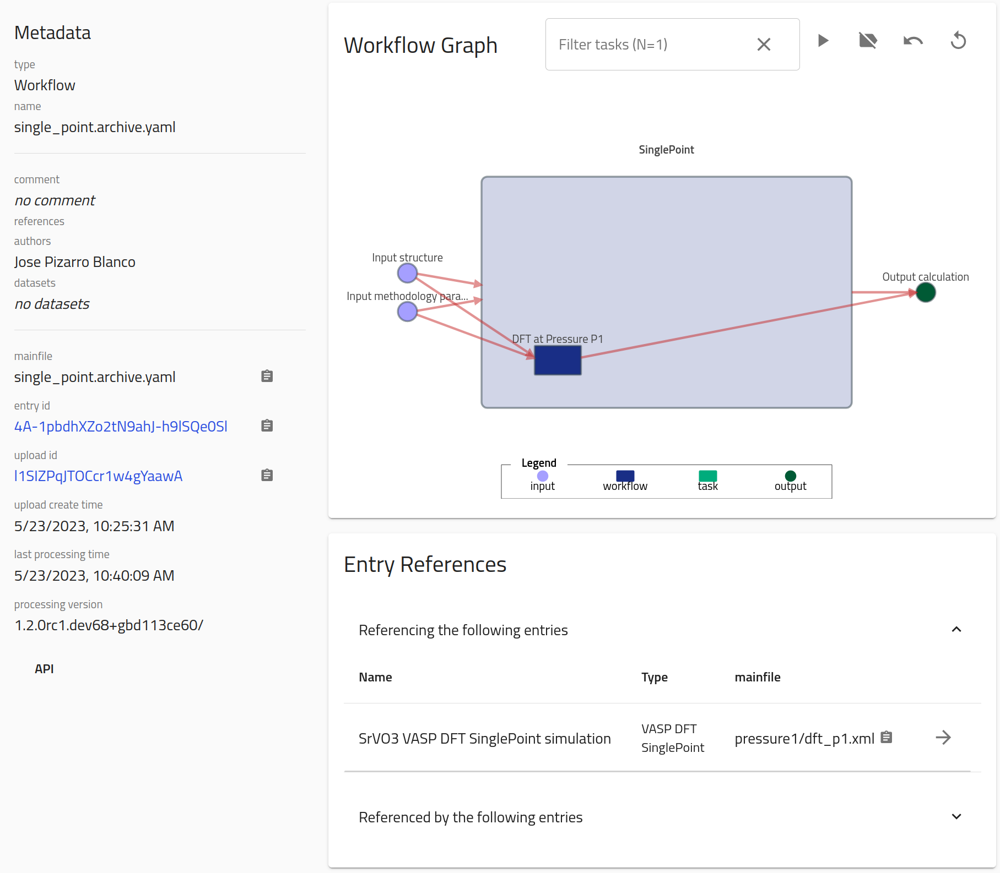
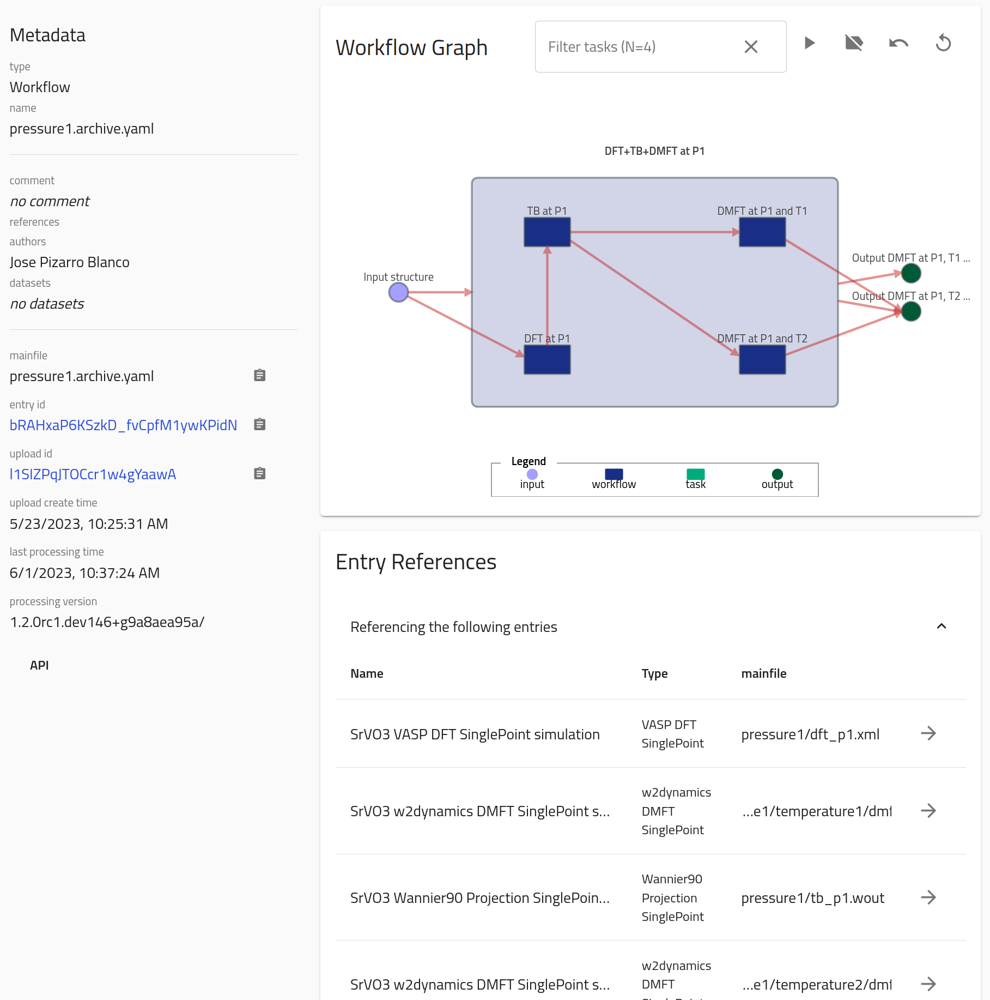
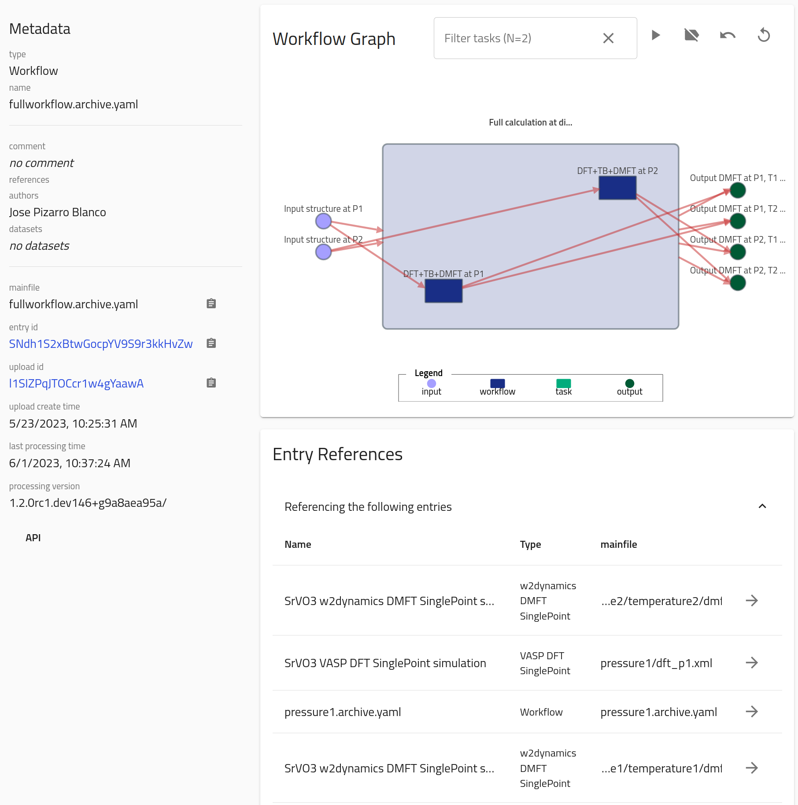

# Standard and Custom Computational Workflows in NOMAD

The following examples contain the basic knowledge on understanding and learning to use NOMAD workflows, and its relation with DFT and beyond-DFT (GW, BSE, DMFT, etc.) methodologies. You will use a fictitious example of a simulation workflow with the following files and folder structure:
```
.
├── pressure1
│   ├── temperature1
│   │   ├── dmft_p1_t1.hdf5
│   │   └── ...extra auxiliary files
│   ├── temperature2
│   │   ├── dmft_p1_t2.hdf5
│   │   └── ...extra auxiliary files
│   ├── dft_p1.xml
│   ├── tb_p1.wout
│   └── ...extra auxiliary files
└── pressure2
    ├── temperature1
    │   ├── dmft_p2_t1.hdf5
    │   └── ...extra auxiliary files
    ├── temperature2
    │   ├── dmft_p2_t2.hdf5
    │   └── ...extra auxiliary files
    ├── dft_p2.xml
    ├── tb_p2.wout
    └── ...extra auxiliary files
```

which can be downloaded here:
<center>
[Download example_files.zip](data/example_files.zip){ .md-button .nomad-button }
</center>

Each of the _mainfiles_ represent an electronic-structure calculation (either [DFT](https://en.wikipedia.org/wiki/Density_functional_theory){:target="_blank"}, [TB](https://en.wikipedia.org/wiki/Tight_binding){:target="_blank"}, or [DMFT](https://en.wikipedia.org/wiki/Dynamical_mean-field_theory){:target="_blank"}) which in turn is then parsed into a singular _entry_ in NOMAD. When dragged into the [NOMAD Upload page](https://nomad-lab.eu/prod/v1/staging/gui/user/uploads){:target="_blank"}, these files should generate 8 entries in total. This folder structure presents a typical workflow calculation which can be represented as a provenance graph:
```mermaid
graph LR;
    A2((Inputs)) --> B2[DFT];
    A1((Inputs)) --> B1[DFT];
    subgraph pressure P<sub>2</sub>
    B2[DFT] --> C2[TB];
    C2[TB] --> D21[DMFT at T<sub>1</sub>];
    C2[TB] --> D22[DMFT at T<sub>2</sub>];
    end
    D21[DMFT at T<sub>1</sub>] --> E21([Output calculation P<sub>2</sub>, T<sub>1</sub>])
    D22[DMFT at T<sub>2</sub>] --> E22([Output calculation P<sub>2</sub>, T<sub>2</sub>])
    subgraph pressure P<sub>1</sub>
    B1[DFT] --> C1[TB];
    C1[TB] --> D11[DMFT at T<sub>1</sub>];
    C1[TB] --> D12[DMFT at T<sub>2</sub>];
    end
    D11[DMFT at T<sub>1</sub>] --> E11([Output calculation P<sub>1</sub>, T<sub>1</sub>])
    D12[DMFT at T<sub>2</sub>] --> E12([Output calculation P<sub>1</sub>, T<sub>2</sub>])
```
Here, "Input" refers to the all _input_ information given to perform the calculation (e.g., atom positions, model parameters, experimental initial conditions, etc.). "DFT", "TB" and "DMFT" refer to individual _tasks_ of the workflow, which each correspond to a _SinglePoint_ entry in NOMAD. "Output calculation" refers to the _output_ data of each of the final DMFT tasks.

The goal of this part is to set up the following workflows:

1. A `SinglePoint` workflow for one of the calculations (e.g., the DFT one) in the `pressure1` subfolder.
2. An overarching workflow entry for each pressure P<sub>i=1,2</sub>, grouping all `SinglePoint` "DFT", "TB", "DMFT at T<sub>1</sub>", and "DMFT at T<sub>2</sub>" tasks.
3. A top level workflow entry, grouping together all pressure calculations.

The files for all these cases can be downloaded here:
<center>
[Download worfklowyaml_files.zip](data/workflowyaml_files.zip){ .md-button .nomad-button }
</center>

 You can try writing these files yourself first, and then compare them with the tested files.


## Starting example: SinglePoint workflow

NOMAD is able to recognize certain workflows in an automatic way, such as the `SinglePoint` case mentioned above. However, to showcase how to the use workflows in NOMAD, you will learn how to "manually" construct the SinglePoint workflow, represented by the following provenance graph:

To define a workflow manually in NOMAD, you must add a YAML file to the upload folder that contains the relevant input, output, and task information. This file should be named `<filename>.archive.yaml`. In this case, you should include the file `single_point.archive.yaml` with the following content:

```yaml
workflow2:
  name: SinglePoint
  inputs:
    - name: Input structure
      section: '../upload/archive/mainfile/pressure1/dft_p1.xml#/run/0/system/-1'
  outputs:
    - name: Output calculation
      section: '../upload/archive/mainfile/pressure1/dft_p1.xml#/run/0/calculation/-1'
  tasks:
    - m_def: nomad.datamodel.metainfo.workflow.TaskReference
      task: '../upload/archive/mainfile/pressure1/dft_p1.xml#/workflow2'
      name: DFT at Pressure P1
      inputs:
        - name: Input structure
          section: '../upload/archive/mainfile/pressure1/dft_p1.xml#/run/0/system/-1'
      outputs:
        - name: Output calculation
          section: '../upload/archive/mainfile/pressure1/dft_p1.xml#/run/0/calculation/-1'
```

Note several things about the content of this file:

1. **`name`** keys are optional.
2. The root path of the upload can be referenced with `../upload/archive/mainfile/`. Starting from there, the original directory tree structure of the upload is maintained.
3. **`inputs`** reference the section containing inputs of the whole workflow. In this case this is the section `run[0].system[-1]` parsed from the mainfile in the path `pressure1/dft_p1.xml`.
4. **`outputs`** reference the section containing outputs of the whole workflow. In this case this is the section `run[0].calculation[-1]` parsed from the mainfile in the path `pressure1/dft_p1.xml`.
5. **`tasks`** reference the section containing tasks of each step in the workflow. These must also contain `inputs` and `outputs` properly referencing the corresponding sections; this will then _link_ inputs/outputs/tasks in the NOMAD Archive. In this case this is a `TaskReference` to the section `workflow2` parsed from the mainfile in the path `pressure1/dft_p1.xml`.
6. **`section`** reference to the uploaded mainfile specific section. The left side of the `#` symbol contains the path to the _mainfile_, while the right contains the path to the _section_.

This will produce an extra entry with the following Overview content:

{.screenshot}

Note that you are referencing sections which are lists. Thus, in each case you should be careful to reference the correct section for inputs and outputs (example: a `GeometryOptimization` workflow calculation will have the "Input structure" as `run[0].system[0]`, while the "Output calculation" would also contain `run[0].system[-1]`, and all intermediate steps must input/output the corresponding section system).

!!! note "NOMAD workflow filename"
    The NOMAD workflow YAML file name, i.e., `<filename>` in the explanation above, can be any custom name defined by the user, but the file **must** keep the extension `.archive.yaml` at the end. This is done in order for NOMAD to recognize this file as a _custom schema_. Custom schemas are widely used in experimental parsing, and you can learn more about them in the [FAIRmat tutorial 8](https://www.fairmat-nfdi.eu/events/fairmat-tutorial-8/tutorial-8-home).

You can extend the workflow meta-information by adding the metholodogical input parameters. These are stored in NOMAD in the section path `run[0].method[-1]`. The new `single_point.archive.yaml` will be:

```yaml
workflow2:
  name: SinglePoint
  inputs:
    - name: Input structure
      section: '../upload/archive/mainfile/pressure1/dft_p1.xml#/run/0/system/-1'
    - name: Input methodology parameters
      section: '../upload/archive/mainfile/pressure1/dft_p1.xml#/run/0/method/-1'
  outputs:
    - name: Output calculation
      section: '../upload/archive/mainfile/pressure1/dft_p1.xml#/run/0/calculation/-1'
  tasks:
    - m_def: nomad.datamodel.metainfo.workflow.TaskReference
      task: '../upload/archive/mainfile/pressure1/dft_p1.xml#/workflow2'
      name: DFT at Pressure P1
      inputs:
        - name: Input structure
          section: '../upload/archive/mainfile/pressure1/dft_p1.xml#/run/0/system/-1'
        - name: Input methodology parameters
          section: '../upload/archive/mainfile/pressure1/dft_p1.xml#/run/0/method/-1'
      outputs:
        - name: Output calculation
          section: '../upload/archive/mainfile/pressure1/dft_p1.xml#/run/0/calculation/-1'
```

which in turn produces a similar workflow than before, but with an extra input node:

{.screenshot}


## Pressure workflows

Now that you know the basics of the workflow YAML schema, let's try to define an overarching workflow for each of the pressures. For this section, you will learn how to create the workflow YAML schema for the P<sub>1</sub> case; the extension for P<sub>2</sub> is then a matter of changing names and paths in the YAML files. For simplicity, you can skip referencing to methodologies.

Thus, the `inputs` can be defined as:
```yaml
workflow2:
  name: DFT+TB+DMFT at P1
  inputs:
    - name: Input structure
      section: '../upload/archive/mainfile/pressure1/dft_p1.xml#/run/0/system/-1'
```
and there are two `outputs`, one for each of the DMFT calculations at distinct temperatures:
```yaml
  outputs:
    - name: Output DMFT at P1, T1 calculation
      section: '../upload/archive/mainfile/pressure1/temperature1/dmft_p1_t1.hdf5#/run/0/calculation/-1'
    - name: Output DMFT at P1, T2 calculation
      section: '../upload/archive/mainfile/pressure1/temperature2/dmft_p1_t2.hdf5#/run/0/calculation/-1'
```
Now, `tasks` are defined for each of the methodologies performed (each corresponding to an underlying SinglePoint workflow). To define a valid workflow, each task must contain an input that corresponds to one of the outputs of the previous task. Moreover, the first task should take as input the overall input of the workflow, and the final task should also have as an output the overall workflow output.
Then:
```yaml
  tasks:
    - m_def: nomad.datamodel.metainfo.workflow.TaskReference
      task: '../upload/archive/mainfile/pressure1/dft_p1.xml#/workflow2'
      name: DFT at P1
      inputs:
        - name: Input structure
          section: '../upload/archive/mainfile/pressure1/dft_p1.xml#/run/0/system/-1'
      outputs:
        - name: Output DFT at P1 calculation
          section: '../upload/archive/mainfile/pressure1/dft_p1.xml#/run/0/calculation/-1'
    - m_def: nomad.datamodel.metainfo.workflow.TaskReference
      task: '../upload/archive/mainfile/pressure1/tb_p1.wout#/workflow2'
      name: TB at P1
      inputs:
        - name: Input DFT at P1 calculation
          section: '../upload/archive/mainfile/pressure1/dft_p1.xml#/run/0/calculation/-1'
      outputs:
        - name: Output TB at P1 calculation
          section: '../upload/archive/mainfile/pressure1/tb_p1.wout#/run/0/calculation/-1'
    - m_def: nomad.datamodel.metainfo.workflow.TaskReference
      task: '../upload/archive/mainfile/pressure1/temperature1/dmft_p1_t1.hdf5#/workflow2'
      name: DMFT at P1 and T1
      inputs:
        - name: Input TB at P1 calculation
          section: '../upload/archive/mainfile/pressure1/tb_p1.wout#/run/0/calculation/-1'
      outputs:
        - name: Output DMFT at P1, T1 calculation
          section: '../upload/archive/mainfile/pressure1/temperature1/dmft_p1_t1.hdf5#/run/0/calculation/-1'
    - m_def: nomad.datamodel.metainfo.workflow.TaskReference
      task: '../upload/archive/mainfile/pressure1/temperature1/dmft_p1_t1.hdf5#/workflow2'
      name: DMFT at P1 and T2
      inputs:
        - name: Input TB at P1 calculation
          section: '../upload/archive/mainfile/pressure1/tb_p1.wout#/run/0/calculation/-1'
      outputs:
        - name: Output DMFT at P1, T2 calculation
          section: '../upload/archive/mainfile/pressure1/temperature2/dmft_p1_t2.hdf5#/run/0/calculation/-1'
```
Note here:

- The `inputs` for each subsequent step are the `outputs` of the previous step.
- The final two `outputs` coincide with the `workflow2` `outputs`.

This workflow (`pressure1.archive.yaml`) file will then produce an entry with the following Overview page:

{.screenshot}

Similarly, for P<sub>2</sub> you can upload a new `pressure2.archive.yaml` file with the same content, except when substituting 'pressure1' and 'p1' by their counterparts. This will produce a similar graph than the one showed before but for "P2".


## The top-level workflow

After adding the workflow YAML files, Your upload folder directory now looks like:
```
.
├── pressure1
│   │   ├── dmft_p1_t1.hdf5
│   │   └── ...extra auxiliary files
│   ├── temperature2
│   │   ├── dmft_p1_t2.hdf5
│   │   └── ...extra auxiliary files
│   ├── dft_p1.xml
│   ├── tb_p1.wout
│   └── ...extra auxiliary files
├── pressure1.archive.yaml
├── pressure2
│   ├── temperature1
│   │   ├── dmft_p2_t1.hdf5
│   │   └── ...extra auxiliary files
│   ├── temperature2
│   │   ├── dmft_p2_t2.hdf5
│   │   └── ...extra auxiliary files
│   ├── dft_p2.xml
│   ├── tb_p2.wout
│   └── ...extra auxiliary files
├── pressure2.archive.yaml
└── single_point.archive.yaml
```
In order to define the general workflow that groups all pressure calculations, YOU can reference directly the previous `pressureX.archive.yaml` files as tasks. Still, `inputs` and `outputs` must be referenced to their corresponding mainfile and section paths.

Create a new `fullworkflow.archive.yaml` file with the `inputs`:
```yaml
workflow2:
  name: Full calculation at different pressures for SrVO3
  inputs:
    - name: Input structure at P1
      section: '../upload/archive/mainfile/pressure1/dft_p1.xml#/run/0/system/-1'
    - name: Input structure at P2
      section: '../upload/archive/mainfile/pressure2/dft_p2.xml#/run/0/system/-1'
```
And `outputs`:
```yaml
  outputs:
    - name: Output DMFT at P1, T1 calculation
      section: '../upload/archive/mainfile/pressure1/temperature1/dmft_p1_t1.hdf5#/run/0/calculation/-1'
    - name: Output DMFT at P1, T2 calculation
      section: '../upload/archive/mainfile/pressure1/temperature2/dmft_p1_t2.hdf5#/run/0/calculation/-1'
    - name: Output DMFT at P2, T1 calculation
      section: '../upload/archive/mainfile/pressure2/temperature1/dmft_p2_t1.hdf5#/run/0/calculation/-1'
    - name: Output DMFT at P2, T2 calculation
      section: '../upload/archive/mainfile/pressure2/temperature2/dmft_p2_t2.hdf5#/run/0/calculation/-1'
```
Finally, `tasks` references the previous YAML schemas as follows:
```yaml
  tasks:
    - m_def: nomad.datamodel.metainfo.workflow.TaskReference
      task: '../upload/archive/mainfile/pressure1.archive.yaml#/workflow2'
      name: DFT+TB+DMFT at P1
      inputs:
        - name: Input structure at P1
          section: '../upload/archive/mainfile/pressure1/dft_p1.xml#/run/0/system/-1'
      outputs:
        - name: Output DMFT at P1, T1 calculation
          section: '../upload/archive/mainfile/pressure1/temperature1/dmft_p1_t1.hdf5#/run/0/calculation/-1'
        - name: Output DMFT at P1, T2 calculation
          section: '../upload/archive/mainfile/pressure1/temperature2/dmft_p1_t2.hdf5#/run/0/calculation/-1'
    - m_def: nomad.datamodel.metainfo.workflow.TaskReference
      task: '../upload/archive/mainfile/pressure2.archive.yaml#/workflow2'
      name: DFT+TB+DMFT at P2
      inputs:
        - name: Input structure at P2
          section: '../upload/archive/mainfile/pressure2/dft_p2.xml#/run/0/system/-1'
      outputs:
        - name: Output DMFT at P2, T1 calculation
          section: '../upload/archive/mainfile/pressure2/temperature1/dmft_p2_t1.hdf5#/run/0/calculation/-1'
        - name: Output DMFT at P2, T2 calculation
          section: '../upload/archive/mainfile/pressure2/temperature2/dmft_p2_t2.hdf5#/run/0/calculation/-1'
```

This will produce the following entry and its Overview page:

{.screenshot}


## Automatic workflows

There are some cases where the NOMAD infrastructure is able to recognize certain workflows automatically when processing the uploaded files. The simplest example is any `SinglePoint` calculation, as explained above. Other examples include `GeometryOptimization`, `Phonons`, `GW`, and `MolecularDynamics`. Automated workflow detection may require your folder structure to fulfill certain conditions.

Here are some general guidelines for preparing your upload folder in order to make it easier for the _automatic workflow recognition_ to work:

- Always organize your files in an **top-down structure**, i.e., the initial _tasks_ should be upper in the directory tree, while the later _tasks_ lower on it.
- Avoid having to go up and down between folders if some properties are derived between these files. These situations are very complicated to predict for the current NOMAD infrastructure.
- Avoid duplication of files in subfolders. If initially you do a calculation A from which a later calculation B is derived and you want to store B in a subfolder, there is no need to copy the A files inside the subfolder B.

The folder structure used throughout this part is a good example of a clean upload which is friendly and easy to work with when defining NOMAD workflows.
<!-- Another example can be found in [Part II](../part2.md), when you learned how to upload a DFT + GW calculation for bulk Si<sub>2</sub>. In this case, an automatic GW workflow entry was generated. -->
