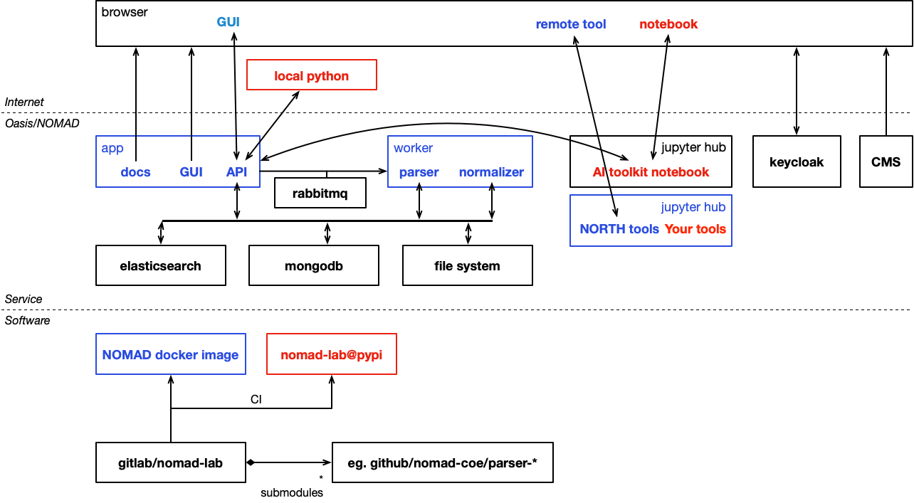
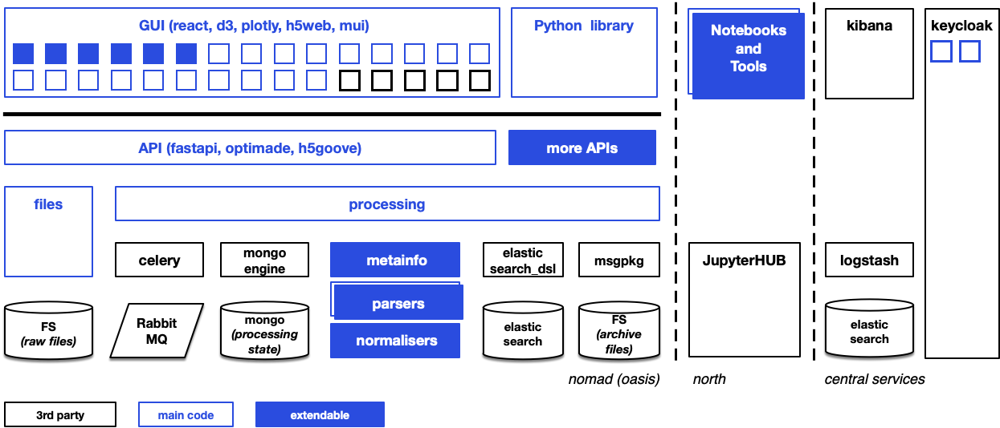

# Architecture

## A containerized cloud enabled architecture

NOMAD is a modern web-application that requires a lot of services to run. Some are
NOMAD specific, others are 3rd party products. While all services can be traditionally
installed and run on a single sever, NOMAD advocates the use of containers and operating
NOMAD in a cloud environment.

<figure markdown>
  
  <figcaption>NOMAD architecture</figcaption>
</figure>

NOMAD comprises two main services, its *app* and the *worker*. The *app* services
our API, graphical user interface, and documentation. It is the outward facing part of
NOMAD. The worker runs all the processing (parsing, normalization). Their separation allows
to scale the system for various use-cases.

Other services are:

- rabbitmq: a task queue that we use to distribute tasks for the *worker* containers
- mongodb: a no-sql database used to maintain processing state and user-metadata
- elasticsearch: a no-sql database and search engine that drives our search
- a regular file system to maintain all the files (*raw* and *archive*)
- jupyterhub: run ai toolkit notebooks
- keycloak: our SSO user management system (can be used by all Oasises)
- a content management system to provide other web-page content (not part of the Oasis)

All NOMAD software is bundled in a single NOMAD docker image and a Python package
([nomad-lab on pypi](https://pypi.org/project/nomad-lab/){:target="_blank"}). The NOMAD docker
image can be downloaded from our public registry.
NOMAD software is organized in multiple git repositories. We use continuous integration
to constantly provide the latest version of docker image and Python package.

## NOMAD uses a modern and rich stack frameworks, systems, and libraries

Besides various scientific computing, machine learning, and computational material
science libraries (e.g. numpy, skikitlearn, tensorflow, ase, spglib, matid, and many more),
Nomad uses a set of freely available technologies that already solve most
of its processing, storage, availability, and scaling goals. The following is a non
comprehensive overview of used languages, libraries, frameworks, and services.

<figure markdown>
  
  <figcaption>NOMAD components and dependencies</figcaption>
</figure>

#### Python 3

The *backend* of nomad is written in Python. This includes all parsers, normalizers,
and other data processing. We only use Python 3 and there is no compatibility with
Python 2. Code is formatted close to [pep8](https://www.python.org/dev/peps/pep-0008/){:target="_blank"},
critical parts use [pep484](https://www.python.org/dev/peps/pep-0484/){:target="_blank"} type-hints.
[ruff](https://docs.astral.sh/ruff){:target="_blank"}, and
[mypy](http://mypy-lang.org/){:target="_blank"} (static type checker) are used to ensure quality.
Tests are written with [pytest](https://docs.pytest.org/en/latest/contents.html){:target="_blank"}.
Logging is done with [structlog](https://www.structlog.org/en/stable/){:target="_blank"} and *logstash* (see
Elasticstack below). Documentation is driven by [Sphinx](http://www.sphinx-doc.org/en/master/){:target="_blank"}.

#### celery

[Celery](http://celeryproject.org){:target="_blank"} (+ [rabbitmq](https://www.rabbitmq.com/){:target="_blank"})
is a popular combination for realizing long running tasks in internet applications.
We use it to drive the processing of uploaded files.
It allows us to transparently distribute processing load while keeping processing state
available to inform the user.

#### elastic search

[Elasticsearch](https://www.elastic.co/webinars/getting-started-elasticsearch){:target="_blank"}
is used to store repository data (not the raw files).
Elasticsearch enables flexible, scalable search and analytics.

#### mongodb

[Mongodb](https://docs.mongodb.com/){:target="_blank"} is used to store and track the state of the
processing of uploaded files and the generated entries. We use
[mongoengine](http://docs.mongoengine.org/){:target="_blank"} to program with mongodb.

#### Keycloak

[Keycloak](https://www.keycloak.org/){:target="_blank"} is used for user management. It manages users and
provides functions for registration, forgetting passwords, editing user accounts, and single
sign-on to fairdi@nomad and other related services.

#### FastAPI

The ReSTful API is build with the [FastAPI](https://fastapi.tiangolo.com/){:target="_blank"}
framework. This allows us to automatically derive a [OpenAPI](https://swagger.io/specification/){:target="_blank"} description
of the nomad API.
Fruthermore, you can browse and use the API via [OpenAPI dashboard](https://swagger.io/tools/swagger-ui/){:target="_blank"}.

#### Elasticstack

The [elastic stack](https://www.elastic.co/guide/index.html){:target="_blank"}
(previously *ELK* stack) is a centralized logging, metrics, and monitoring
solution that collects data within the cluster and provides a flexible analytics front end
for that data.

#### Javascript, React, Material-UI

The frontend (GUI) of **nomad@FAIRDI** is built on the
[React](https://reactjs.org/docs/getting-started.html){:target="_blank"} component framework.
This allows us to build the GUI as a set of re-usable components to
achieve a coherent representations for all aspects of nomad, while keeping development
efforts manageable. React uses [JSX](https://reactjs.org/docs/introducing-jsx.html){:target="_blank"}
(a ES6 variety) that allows to mix HTML with Javascript code.
The component library [Material-UI](https://material-ui.com/){:target="_blank"}
(based on Google's popular material design framework) provides a consistent look-and-feel.

#### docker

To run a **nomad@FAIRDI** instance, many services have to be orchestrated:
the nomad app, nomad worker, mongodb, Elasticsearch, Keycloak, RabbitMQ,
Elasticstack (logging), the nomad GUI, and a reverse proxy to keep everything together.
Further services might be needed (e.g. JypiterHUB), when nomad grows.
The container platform [Docker](https://docs.docker.com/){:target="_blank"} allows us to provide all services
as pre-build images that can be run flexibly on all types of platforms, networks,
and storage solutions. [Docker-compose](https://docs.docker.com/compose/){:target="_blank"} allows us to
provide configuration to run the whole nomad stack on a single server node.

#### kubernetes + helm

To run and scale nomad on a cluster, you can use [kubernetes](https://kubernetes.io/docs/home/){:target="_blank"}
to orchestrated the  necessary containers. We provide a [helm](https://docs.helm.sh/){:target="_blank"}
chart with all necessary service and deployment descriptors that allow you to set up and
update nomad with only a few commands.

#### GitLab

Nomad as a software project is managed via [GitLab](https://docs.gitlab.com/){:target="_blank"}.
The **nomad@FAIRDI** project is hosted [here](https://gitlab.mpcdf.mpg.de/nomad-lab/nomad-FAIR){:target="_blank"}.
GitLab is used to manage versions, different branches of development, tasks and issues,
as a [registry for Docker images](https://docs.gitlab.com/ee/user/packages/container_registry/index.html){:target="_blank"},
and [CI/CD platform](https://docs.gitlab.com/ee/ci/){:target="_blank"}.
