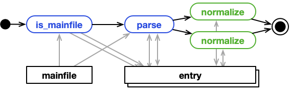

# Processing

NOMAD extracts structured data from files via *processing*. Processing creates
[*entries*](../reference/glossary.md#entry) from files. It produces the schema-based structured
data associated with each entry (i.e. the [*entry archives*](../reference/glossary.md#archive)). To understand the role of processing
in NOMAD also read the ["From file to data" page](./basics.md).

## Processing steps

Processing comprises three steps.

1. **Matching** files to parsers that can process
them. This step also creates empty entries for matched files.
Those matched files are now [*mainfiles*](../reference/glossary.md#mainfile) and forever paired with the created entries.
2. **Parsing** and **normalizing** to produce [*entry archives*](../reference/glossary.md#archive) for matched mainfile/entry-pairs.
3. **Persisting** (including indexing of) the extracted data.

<figure markdown>
  
  <figcaption>Processing steps and how they interact with files, entries, and archives.</figcaption>
</figure>


## Processing triggers, scheduling, execution

For most end-users, processing is fully automated and will be automatically run when
files are added or changed. Here, processing is triggered by the file upload API.
However, in more [advanced scenarios](#processing-scenarios), other triggers might apply.
The three possible triggers are:

- New files are uploaded or existing files are changed. This includes creating and updating ELN entries.
The respective file upload API will call the processing.
- The processing of an upload is manually triggered, e.g. to re-process data. This might be done via the UI, the API, or CLI.
- The processing of one entry, programmatically triggers the processing of other files, e.g. in a `normalize` function.

Most processing is done asynchronously. Entities that need processing
are scheduled in a queue. Depending on the trigger, this might happen in the NOMAD app
(i.a. via API), from a shell on a NOMAD server (i.e. via CLI), or from another processing
in the NOMAD worker. Tasks in the queue are picked up by the NOMAD worker.
See also the [architecture documentation](./architecture.md). The worker can process many entities
from the queue concurrently.

As an exception, entities can also be processed *locally* and synchronously. This means the processing is
not done in the NOMAD worker, but where it is called. This is used for example, when an ELN is saved to have
an immediate update on the respective entry with-in one API call.

## Processed entities

We differentiate two types of entities that can be processed: **uploads** and **entries**.
The same entity can only be scheduled for processing, if it is not already scheduled or processing.
See also the [documentation "from files to data"](./basics.md) to understand the relationships
between all NOMAD entities.

### Uploads
Upload processing is scheduled if one or many files in the upload have changed. Upload processing
includes the matching step, it creates new entries, and triggers the processing of
new or afflicted entries. An upload is considered processing as long as any of its entries
is still processing (or scheduled to be processed).

### Entries
In most scenarios, entry processing is not triggered individually, but as part of an upload
processing. Many entries of one upload might be processed at the same time. Some order
can be enforced through *processing levels*. Levels are part of the parser metadata and
entries paired to parsers with a higher level are processed after entries with a
parser of lower level. See also [how to write parsers](../howto/plugins/parsers.md).


## Customize processing

NOMAD provides just the framework for processing. The actual work depends on plugins, parsers
and schemas for specific file types. While NOMAD comes with a build-in set of plugins, you can build your own plugins to support new file types, ELNs, and workflows.

### Schemas, parsers, plugins

The primary function of a parser is to systematically analyze and organize the incoming data, ensuring adherence to the established schema.
The interaction between a parser and a schema plays a crucial role in ensuring data consistency to a predefined structure. It takes raw data inputs and utilizes the schema as a guide to interpret and organize the information correctly. By connecting the parser to the schema, users can establish a framework for the expected data structure. The modular nature of the parser and schema relationship allows for flexibility, as the parser can be designed to accommodate various schemas, making it adaptable to different data models or updates in research requirements.
This process ensures that the resulting filled template meets the compliance standards dictated by the schema.

Processing is run on the NOMAD (Oasis) server as part of the NOMAD app or worker. In
principle, executed processing code can access all files, all databases, the underlying
host system, etc. Therefore, only audited processing code can be allowed to run. For
this reason, only code that is part of the NOMAD installation can be used and no
user uploaded Python code is allowed.

Therefore, the primary way to customize the processing and add more matching, parsing, and
normalizing, is adding plugins to a NOMAD (Oasis) installation. However,
NOMAD or NOMAD plugins can define base sections that use `normalize` functions that
act on certain data or annotations. Uploaded `.yaml` schemas that use a such base
section, might indirectly use custom processing functionality.

A parser plugin can define a new parser and therefore add to the *matching*, *parsing*, (and *normalizing*).
A schema plugin defines new sections that can contain `normalize` functions that add to the *normalizing*.
See also the how-tos on [plugins installation](../howto/oasis/plugins_install.md), and development of [parsers and schemas](../howto/plugins/plugins.md).

#### Matching

All parsers have a `is_mainfile` function. This is its signature:

```py
def is_mainfile(self, filename: str, ...) -> Union[bool, Iterable[str]]
```

If this function does not return `False`, the parser matches with the file and entries
are created. If the return is `True`, exactly one entry will be created. If the
result is an iterable of strings, the same entry is sill created, but now also additional
entries are created for each string. These strings are called *entry keys* and the additional
entries are *child* entries. See the also [single file, multiple entries scenario](#single-file-single-entry).

In principle, the `is_mainfile` implementation can do whatever it wants: consider the filename, open the file,
reading it partially, reading it whole, etc. However, most NOMAD parsers extend a specialized parser
class called `MatchingParser`. These parsers share one implementation of `is_mainfile` that
uses certain criteria, for example:

- regular expressions on filenames
- regular expressions on mimetypes
- regular expressions on header content

See [How to write a parser](../howto/plugins/parsers.md) for more details.

The matching step of an upload's processing, will call this function for every file
and on all parsers. There are some hidden optimizations and additional parameters, but
logically every parser is tested against every file, until a parser is matched or not.
The first matched parser will be used and the order of configured parser is important.
If no parser can be matched, the file is not considered for processing and no entry
is created.

#### Parsing

All parsers have a `parse` function. This is its signature:

```py
def parse(self, mainfile: str, archive: EntryArchive, ...) -> None
```

This function is called when a mainfile has already been matched and the entry has
already been created with an empty archive. The entry mainfile and archive are passed as parameters.

In the case of mainfile keys, an additional keyword argument is given:
`child_archives: Dict[str, EntryArchive]`. Additional child entries have been created for
each key, and this dictionary allows to populate the child archives.

Each `EntryArchive` has an `m_context` field. This context provides functions
to access the file system, open other files, open the archives of other entries,
create or update files, spawn the processing of created or updated files.
See also the [create files, spawn entries scenario](#creating-files-spawning-entries).

### Normalizing

After parsing, entries are "normalized". We distinguish *normalizers* and `normalize`
functions.

Normalizers are Python classes. All normalizers
are called for all archives. What normalizers are called and in what order is
part of the NOMAD (Oasis) configuration. Normalizers have been developed to implement
code independent processing steps that have to be applied to all entries in processing
computational material science data. We are deprecating the use of normalizers and prefer
the use of `normalize` functions.

When you define a schema in Python, sections are defined as Python classes. These
classes can have a function with the following signature:

```py
def normalize(self, archive: EntryArchive, ...)
```
These `normalize` functions can modify the given section instance `self` or the
entry `archive` as a whole. Through the `archive`, Normalize functions also have access to
the `context` and can do all kinds of file or processing operations from there.
See also [processing scenarios](#processing-scenarios).

Normalize functions are called in a particular order that follows a depth first
traversal of the archives containment tree. If section definition classes inherit
from each other, it is important to include respective `super` calls in the normalize
function implementation.

## Processing scenarios

### Single file, single entry

<figure markdown>
  
</figure>

This is the "normal" case. A parser is matched to a mainfile. During processing,
only the mainfile is read to populate the `EntryArchive` with data.

### Multiple files, single entry

<figure markdown>
  
</figure>

Same as above: a parser is matched to a mainfile. But, during processing,
the mainfile and other files are read to populate the `EntryArchive` with data. Only the
mainfile path is handed to the parser. Nothing, prevents it (or subsequent `normalize` functions)
to open and read other *auxiliary* files.

A notable special case are ELNs with `normalize` functions and references to files.
ELNs can be designed to link the ELN with uploaded files via `FileEditQuantities` (see
also [How to define ELNs](../howto/customization/elns.md#example-eln-schema) or [ELN Annotations](../reference/annotations.md#eln-annotations)).
The underlying ELN's schema usually defines `normalize` functions that open the referenced
files for more data. Certain modes of the [tabular parser](../howto/customization/tabular.md), for example, use
this.

### Single file, multiple entries

<figure markdown>
  
</figure>

A parser can match a mainfile in two ways. It's `is_mainfile` function can simply return `True`,
meaning that the parser can parse this file. Or, it returns a list of keys. With the
list of keys NOMAD will create an additional child entry for each key, and the parser's `parse` function
is passed the archives of the additional child entries. One example is a parser for a tabular format that
produces individual entries for each row of the table.

Since `normalize` functions are defined as part of `Sections` in a schema and called for
section instances, the `normalize` functions are called individually for the entry and
all child entries.

Normally the IDs of entries are computed from the upload ID and the mainfile path. For
entries created from a mainfile and a key, the key is also included in the ID. Also here
the entry identity is internally locked to the mainfile (and the respective key).

### Creating files, spawning entries

<figure markdown>
  
</figure>

During processing, parsers or `normalize` functions can also create new (or update existing)
files. And the processing might also trigger processing of these freshly created (or updated)
files.

For examples an ELN might be used to link multiple files of proprietary type.
A `normalize` function can mix the data from those files with data from the ELN itself
to convert everything into a file with a more standardized format. In experimental
settings, this allows to merge proprietary instrument output and manual notes into a standardized
representation of a measurement. The goal is not to fill an archive with all data
directly, but have the created file parsed and create an entry with all data this way.

Another use-case is automation. The `normalize` function of on ELN schema might use
user input to create many more ELNs. This can be use-ful for parameter studies, where
one experiment has to be repeated many times in a consistent way.

### Re-processing

Typically a new file is uploaded, an entry created, and processed. But, we also need
to re-processing entries because either the file was changed (e.g. an ELN was changed and saved
or a new version of a file was uploaded), or because the parser or schema (including `normalize` functions)
was changed. While the first case, usually triggers automated re-processing, the later
case required manual intervention.

Either the user manually re-processes an upload from the UI, because they know that
they changed a respective schema for example, or the NOMAD (Oasis) admin re-processes
(all) uploads, e.g. via the CLI, because they know the NOMAD version or some plugin has
changed.

Depending on configuration, re-processing might only process existing entries, match
for new entries, or remove entries that no longer match.

## Strategies for re-usable processing code

Processing takes files as input and creates entries with structured data. It is about
transforming data from one representation into another. Sometime, different input
representations have to be transformed into the same output. Sometimes, the same
input representation has to be transformed to different outputs. Input and output
representation might evolve over time and processing has to be adopted. To avoid
combinatorial explosion and manage moving sources and targets, it might be wise to
modularize processing code more than just having `is_mainfile`, `parse`, and `normalize`
functions.

### Readers: different input, similar output

Consider different file formats that capture similar data. Sometimes it is even the
same container format (e.g. JSON or yaml), but slightly different keys, numbers are
scaled differently, units are different, etc.

We could write multiple parser, but the part of the parser that populates the archive,
would be very much the same, only the part that reads information from the files,
would be different.

It might be good to define a **reader** like this:
```py
def reader(mainfile: str) -> Dict[str, Any]
```

and capture data in a flexible *intermediate* format.

### Writers: metadata into archives, data into files

Two readers that produce a dictionary with the same keys and compatible values would
allow to re-use the same **writer** that populates an archive, e.g.:

```py
def writer(data: Dict[str, Any], archive: EntryArchive)
```

Similar to multiple *readers*, we might also use multiple *writers*. In certain
scenarios, we need to write read data both into an archive, but also into an additional
file. For example, if data is large, we can only keep metadata in archives, the
actual data should be written to additional HFD5 or Nexus files.

Separation of *readers* and *writers* also allows to re-use parser components in a
`normalize` function. For example, if we consider the [creating files, spawning entries scenario](#creating-files-spawning-entries).

### Evolution of data representations

If the input representation changes, only the *readers* have to change. If output
representations change, only the *writers* have to be changed. If a new input is added,
only a *reader* has to be developed. If a new output becomes necessary, only a new *writer*
has to be developed.

Since we use a flexible intermediate representation such as a `Dict[str, Any]`, it
is easy to add new keys, but it is also dangerous because no static or semantic checking
occurs. *Readers* and *writers* might be a good strategy to re-use parts of a parser,
but *reader* and *writer* implementations remain strongly connected and inter-dependent.

<figure markdown>
  
  <figcaption>Read and written data items might overlap but are rarely the same.</figcaption>
</figure>

It is also important to note, that when using multiple *readers* and *writers*, the
data items (i.e. keys) put into and read from the intermediate data structure might overlap,
but are not necessarily the same sets of items. One reader might read more than another,
the data put into an archive (metadata) might be different, from what is put into
an HDF5 file (data).
