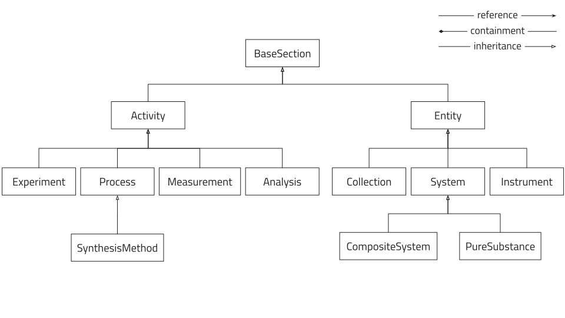
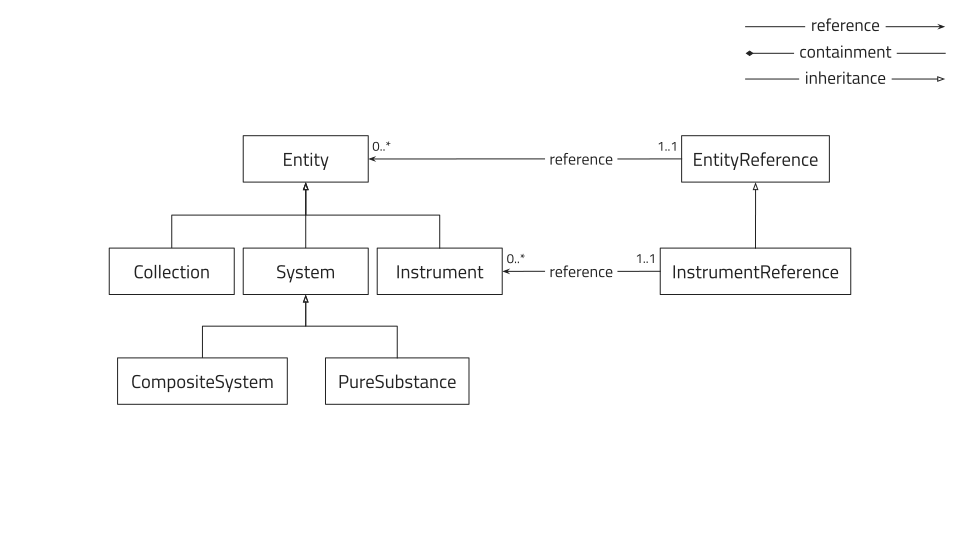
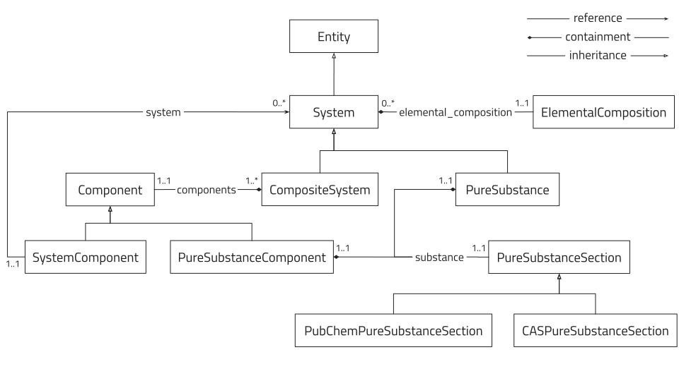
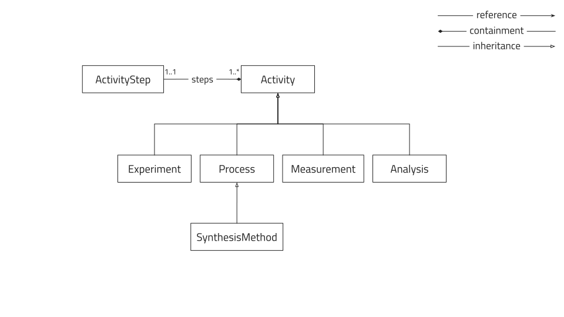
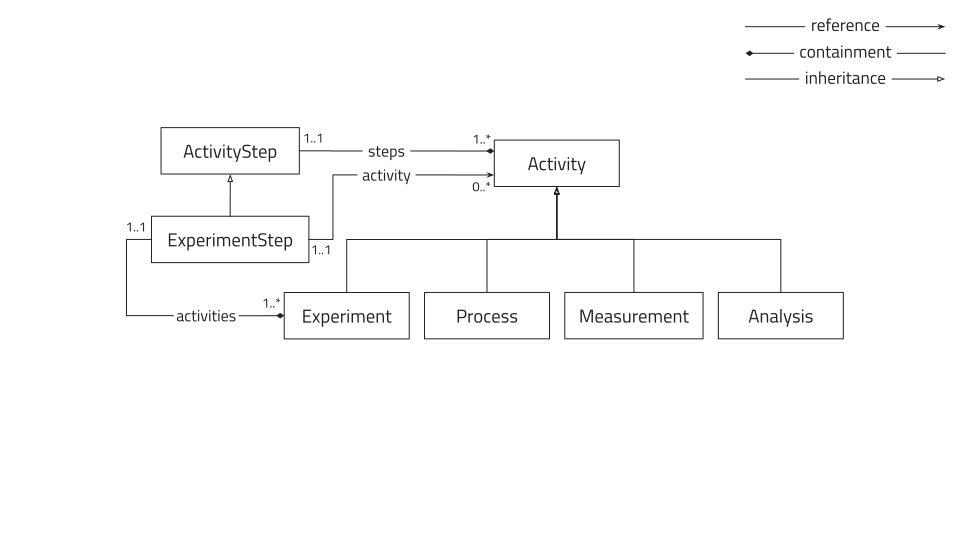
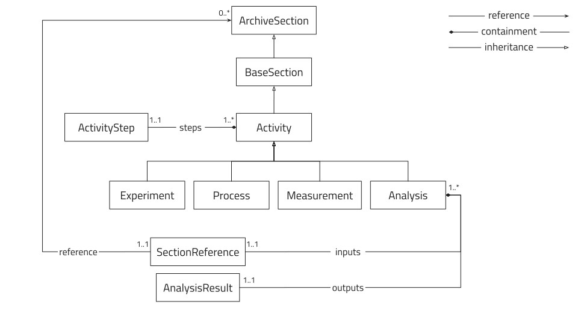

# How to use base sections

As previously mentioned in [How to write a schema](basics.md#base-sections-and-inheritance),
base sections can be used when writing custom schemas to inherit properties and *functionality*
from already defined sections. Here we explain the properties
and functionality of specific base sections and how they can be used.

## `datamodel.metainfo.basesections`

This built-in nomad module contains a set of base sections based on an entity-activity
model.
<!-- TODO add some sort of link to a standard reference for entity-activity model -->

!!! info
    In this part of the documentation we use UML Class diagrams to illustrate the
    inheritance, composition and association between the base sections.
    For more information on UML Class diagrams please see
    [en.wikipedia.org/wiki/Class_diagram](https://en.wikipedia.org/wiki/Class_diagram){:target="_blank"}.



All the base sections defined in this model are abstract in the sense that they cannot be
instantiated in NOMAD directly.
Instead, the user is expected to implement these in their own schemas by inheriting a base
section and `nomad.datamodel.EntryData`.
Furthermore, it is strongly encouraged to use the most specialized section applicable.

!!! example
    If the user is writing a schema for an instrument in their lab, they should ideally
    inherit from `Instrument` (and `EntryData`) rather than directly from `Entity` or
    `BaseSection`.

All sections that are intended to eventually become entries in NOMAD by inheriting from
the entity-activity base sections inherit from `BaseSection`.
This section provides a set of global quantities that provides basic information about the
entry.
Theses are:

- `name`: A short human readable and descriptive name.
- `datetime`: The date and time associated with this section.
- `lab_id`: An ID string that is unique at least for the lab that produced this data.
- `description`: Any information that cannot be captured in the other fields.

### `Entity`

!!! info
    By "Entity" we mean:

    "An object that persists, endures, or continues to exist through time while maintaining
    its identity."

    See [BFO_0000002](http://purl.obolibrary.org/obo/BFO_0000002){:target="_blank"} for semantic context.

The `Entity` section is currently subclassed by `System`, `Collection` and `Instrument`.


#### `Collection`

The `Collection` section should be inherited when attempting to group entities together.


!!! example
    The user wants to write a data schema for a batch of substrates.
    As this is grouping entities together, they should inherit from `Collection`.

##### `EntityReference`

The `EntityReference` section can be composed in any `Activity` (see
[`Activity`](#activity) below) to provide a reference to an `Entity`.
The section contains the following quantities:

- `reference`: A reference to a NOMAD `Entity` entry.
- `lab_id`: The readable identifier for the entity.
- `name`: A short descriptive name for the role of this reference
(inherited from `SectionReference`).

The normalizer for the `EntityReference` class will attempt to fill the `reference` from
the `lab_id` or vice versa.

#### `Instrument`

The `Instrument` section should be inherited when describing any tools used for material
creation or characterization.



#### `System`

The main `Entity` section is `System` which is intended to cover any material system from
atomic to device scale.
This section adds the property `elemental_composition` which is a repeating subsection of
`ElementalComposition` sections.
Each `elemental_composition` section keeps track of a single element and its atomic
fraction within the system.

There are two specializations of `System` which differentiates
between the theoretical concept of a pure material, `PureSubstance`, and an actual physical
material combining several pure substances, `CompositeSystem`.



##### `PubChemPureSubstanceSection`

This is a specialization of the `PureSubstanceSection` which will automatically search the
PubChem database for additional information about the substance.
If a PubChem CID is specified the details are retrieved directly.
Otherwise a search query is made for the filled attributes in the following order:

1. `smile`
2. `canonical_smile`
3. `inchi_key`
4. `iupac_name`
5. `name`
6. `molecular_formula`
7. `cas_number`

### `Activity`

!!! info
    By "Activity" we mean:

    "An action that has a temporal extension and for some time depends on some entity."

    See [BFO_0000015](http://purl.obolibrary.org/obo/BFO_0000015){:target="_blank"} for semantic context.

The `Activity` section is currently subclassed by `Process`, `Measurement`, `Analysis`,
and `Experiment`.
These subclasses are intended to cover all types of activities and should be used instead
of inheriting directly from `Activity`.



#### `Experiment`

The `Experiment` section should be inherited when attempting to group activities together.



!!! example
    In a sample centric view the activities are grouped together by the sample but if the
    researcher is instead interested in an experiment containing activities on multiple
    samples, the `Experiment` section can be inherited to group these together.

#### `Process`

!!! info
    By "Process" we mean:

    "A planned process which results in physical changes in a specified input material.
    [ obi : prs obi : mc obi : fg obi : jf obi : bp ]

    Synonyms:

     - preparative method
     - sample preparation
     - sample preparative method
     - material transformations"

    See [OBI_0000094](http://purl.obolibrary.org/obo/OBI_0000094){:target="_blank"} for semantic context.

The `Process` section is the base for the `SynthesisMethod` section which in turn is
specialized further in the [`nomad-material-processing`](#plugin-nomad-material-processing)
plugin detailed below.
The main feature of the `Process` section is that it adds `ProcessSteps` with a duration.


!!! info
    By "SynthesisMethod" we mean:

    "A method used to synthesise a sample."

    See [CHMO_0001301](http://purl.obolibrary.org/obo/CHMO_0001301){:target="_blank"} for semantic context.

#### `Measurement`

!!! info
    By "Measurement" we mean:

    "A planned process with the objective to produce information about the material entity
    that is the evaluant, by physically examining it or its proxies. [ obi : pppb ]"

    See [OBI_0000070](http://purl.obolibrary.org/obo/OBI_0000070){:target="_blank"} for semantic context.

The `Measurement` section adds `samples` which are references to instances of (subclasses
of) `CompositeSystem`.


#### `Analysis`

!!! info
    By "Analysis" we mean:

    "A planned process that produces output data from input data.

    Synonyms:

     - data processing
     - data analysis"

    See [OBI_0200000](http://purl.obolibrary.org/obo/OBI_0200000){:target="_blank"} for semantic context.

The `Analysis` section provides `inputs` which are references to any section (including
sub sections) of some archive.
In addition, it provides the `outputs` which is a repeating section of `AnalysisResult`
which are intended to be further specialized by the user.



### `ReadableIdentifiers`

This base sub section is meant to be composed into the entity-activity sections mentioned
above to provide a standardized readable identifier.

It is in turn composed by the following quantities:

- `institute`: Alias/short name of the home institute of the owner, i.e. *HZB*.
- `owner`: Alias for the owner of the identified thing. This should be unique within the
institute.
- `datetime`: A datetime associated with the identified thing. In case of an `Activity`,
this should be the starting time and, in case of an `Entity`, the creation time.
- `short_name`: A short name of the the identified thing (e.g. the identifier scribed on
the sample, the process number, or machine name), e.g. 4001-8, YAG-2-34.
This is to be managed and decided internally by the labs, although we recommend to avoid
the following characters in it: "_", "/", "\\" and ".".
- `lab_id`: Full readable id. Ideally a human readable id convention, which is simple,
understandable and still have chances of becoming unique.
If the `owner`, `short_name`, `ìnstitute`, and `datetime` are provided, this will
be formed automatically by joining these components by an underscore (_).
Spaces in any of the individual components will be replaced with hyphens (-).
An example would be hzb_oah_20200602_4001-08.

If owner is not filled the field will be filled by the first two letters of
the first name joined with the first two letters of the last name of the author.
If the institute is not filled a institute abreviations will be constructed from
the author's affiliation.
If no datetime is filled, the datetime will be taken from the `datetime`
property of the parent, if it exists, otherwise the current date and time will be
used.
If no short name is filled, the name will be taken from the parent name, if it
exists, otherwise it will be taken from the archive metadata entry name, if it
exists, and finally if no other options are available it will use the name of the
mainfile.

!!! example
    The user has created a sample section by inheriting from `CompositeSystem` and `EntryData`.
    Now, the user wants to automatically generate a readable `lab_id` based on the logged
    in author.
    This can be accomplished by composing the `ReadableIdentifiers` section into the users
    sample section:

    ```python
    class MySample(CompositeSystem, EntryData):
        '''
        A custom sample section.
        '''
        m_def = Section(
            a_template=dict(
                sample_identifiers=dict(),
            ),
        )
        sample_identifiers = SubSection(
            section_def=ReadableIdentifiers,
        )
    ```

## Plugin: `nomad-material-processing`

This plugin contains more specialized base sections for material processing, is
maintained by FAIRmat and is currently hosted on
[https://github.com/FAIRmat-NFDI](https://github.com/FAIRmat-NFDI/AreaA-data_modeling_and_schemas){:target="_blank"}.