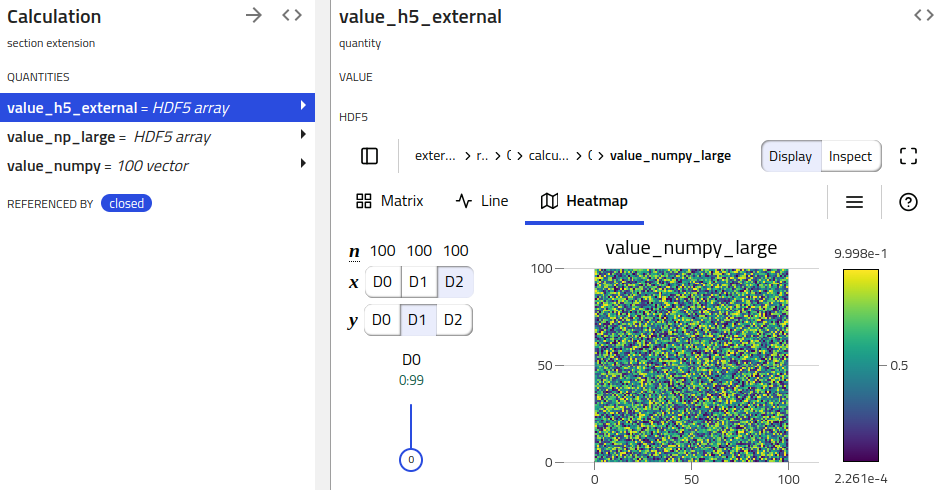

# How to handle large quantities with HDF5

The NOMAD schemas and processed data system is designed to describe and manage
intricate hierarchies of connected data. This is ideal for metadata and lots of small
data quantities, but does not work for large quantities. Quantities are atomic and
are always managed as a whole; there is currently no functionality to stream or
splice large quantities. Consequently, tools that produce or work with such data
cannot scale.

To address the issue, the option to use auxiliary storage systems optimized for large
data is implemented. In the following we discuss two ways to write large datasets to HDF5.
The first is the use of the quantity type `HDF5Reference` and second is the addition of
quantity annotation.

## HDF5Reference

HDF5Reference is a metainfo quantity type intended to reference datasets in external raw
HDF5 files. This can also be used to write large data into an HDF5 file following the
structure of the nomad archive. In following example schema, we define two HDF5Reference
quantities to illustrate these functionalities.

```python
from nomad.datamodel import ArchiveSection
from nomad.metainfo import HDF5Reference

class LargeData(ArchiveSection):
    value_external = Quantity(type=HDF5Reference)
    value = Quantity(type=HDF5Reference)
```

The writing and reading of quantity values to and from an HDF5 file occurs during
processing. For illustration purposes, we mock this by creating `ServerContext`. Furthermore,
we use this section definition for the `data` sub-section of EntryArchive.

```python
import numpy as np

from nomad.datamodel import EntryArchive, EntryMetadata
from nomad.datamodel.context import ServerContext
from nomad.files import StagingUploadFiles
from nomad.processing import Upload

upload_files = StagingUploadFiles(upload_id='test_upload', create=True)
upload = Upload(upload_id='test_upload')
upload_files.add_rawfiles('external.h5')
context = ServerContext(upload=upload)

archive = EntryArchive(
    m_context=context,
    metadata=EntryMetadata(upload_id=upload.upload_id, entry_id='test_entry'),
    data=LargeData(),
)

archive.data.value_external = 'external.h5#/path/to/data'
archive.data.value = np.eye(5)
archive.data.value
# '/uploads/test_upload/archive/test_entry#/data/value'
```

For `value_external`, we assign a reference to a dataset `/path/to/data` in a raw HDF5
file `external.h5` in the same upload. This will simply store this reference and will not
write it to another HDF5 file. To reference a file in another upload, follow the
same form for [reference values](basics.md#different-forms-of-references) e.g.
`/uploads/<upload_id>/raw/large_data.hdf5#group/large_field`
In contrast, when assigning an array to `value`, this is written to an HDF5 extension of the
entry archive and serialized as `/uploads/test_upload/archive/test_entry#/data/value`.
The structure of the HDF5 file will be the same as that of the archive.
!!! important
    When reassigning a different value for an HDF5 archive quantity, it is necessary that the data
    attributes (shape and type) are preserved.

## Existing quantities for large arrays

For existing quantity definitions which one uses for large arrays, it is also possible
to write the data to the HDF5 representation of the archive. This can be done by adding
a `serialization` annotation to the quantity definition.

```python
from nomad.datamodel.metainfo.annotations import HDF5SerializationAnnotation

class LargeData(ArchiveSection):
    value = Quantity(type=np.float64)
    value.m_annotations = dict(serialization=HDF5SerializationAnnotation())
```

Upon serialization, the assigned value will also be written to the archive HDF5 file.
However, the value will remain in memory. This is the difference compared to HDF5Rerence
where the value is immediately written to an HDF5 file and serialized as reference.
During serialization, one also needs to provide the archive context in order to resolve
the reference.

```python
archive.data.value = np.ones(3)

serialized = archive.m_to_dict()
serialized['data']['value']
# '/uploads/test_upload/archive/test_entry#/data/value'
deserialized = archive.m_from_dict(serialized, m_context=archive.m_context)
deserialized.data.value
# array([1., 1., 1.])
```

## Visualizing archive HDF5 quantities

NOMAD clients (e.g. NOMAD UI) can pick up on these HDF5 serialized quantities and
provide respective functionality (e.g. showing a H5Web view).

<figure markdown>
  
  <figcaption>Visualizing archive HDF5 reference quantity using H5Web.</figcaption>
</figure>

!!! warning "Attention"

    This part of the documentation is still work in progress.

## Metadata for large quantities

!!! warning "Attention"

    This will be implemented and documented soon.