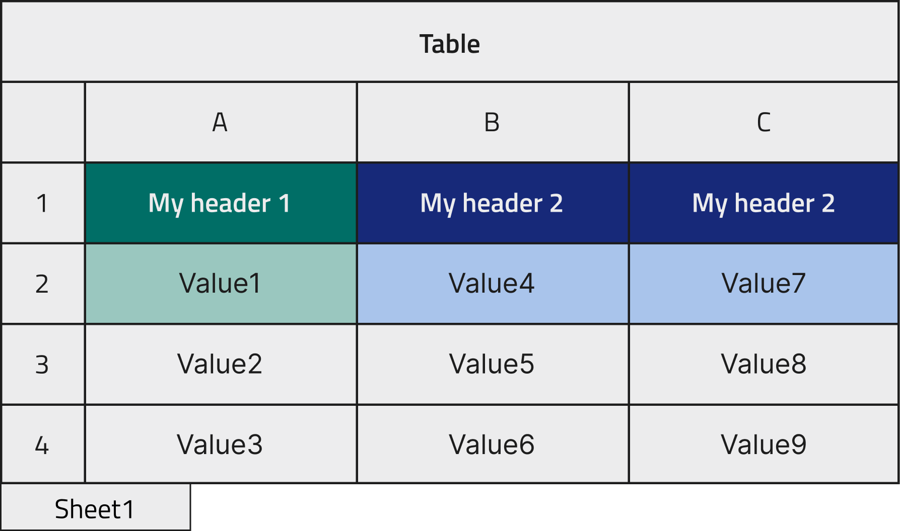
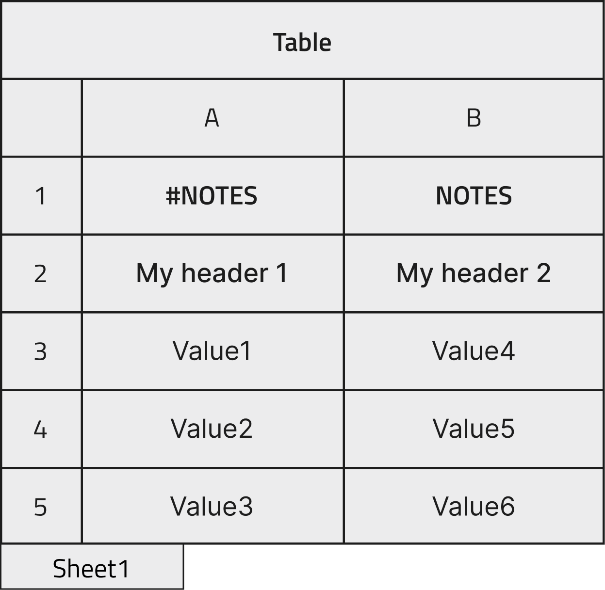
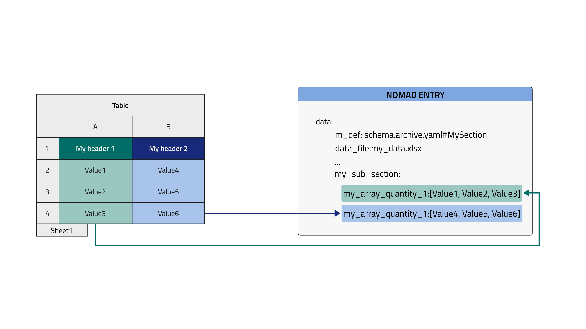
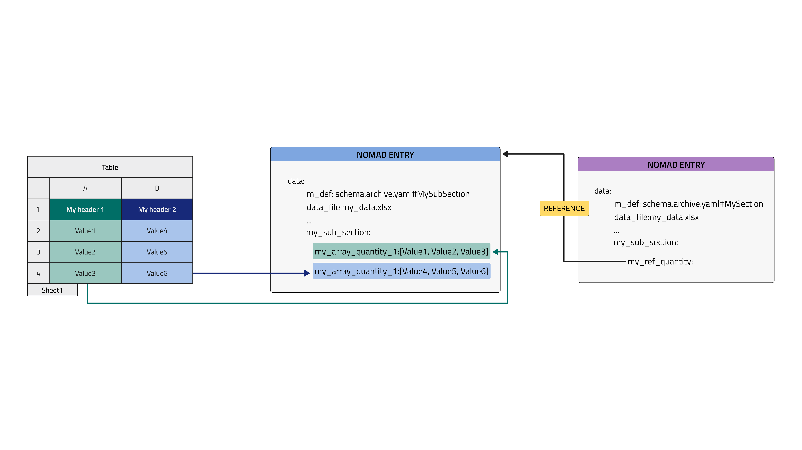

# How to parse tabular data

Refer to the [Reference guide](../../reference/annotations.md) for the full list of annotations connected to this parser and to the [Tabular parser tutorial](../../tutorial/custom.md#the-built-in-tabular-parser)  for a detailed description of each of them.

## Preparing the tabular data file

NOMAD and `Excel` support multiple-sheets data manipulations and imports. Each quantity in the schema will be annotated with a source path composed by sheet name and column header. The path to be used with the tabular data displayed below would be `Sheet1/My header 1` and it would be placed it the `tabular` annotation, see [Schema annotations](../../tutorial/custom.md#to-be-an-entry-or-not-to-be-an-entry) section.

<p align="center" width="100%">
    
</p>

In the case there is only one sheet in the Excel file, or when using a `.csv` file that is a single-sheet format, the sheet name is not required in the path.

The data sheets can be stored in one or more files depending on the user needs. Each sheet can independently be organized in one of the following ways:

1) Columns:<br />
 each column contains an array of cells that we want to parse into one quantity. Example: time and temperature arrays to be plotted as x and y.

<p align="center" width="100%">
    
</p>

2) Rows:<br />
 each row contains a set of cells that we want to parse into a section, i. e. a set of quantities. Example: an inventory tabular data file (for substrates, precursors, or more) where each column represents a property and each row corresponds to one unit stored in the inventory.

<p align="center" width="100%">
    
</p>

3) Rows with repeated columns:<br />


in addition to the mode 2), whenever the parser detects the presence of multiple columns (or multiple sets of columns) with same headers, these are taken as multiple instances of a subsection. More explanations will be delivered when showing the schema for such a structure. Example: a crystal growth process where each row is a step of the crystal growth and the repeated columns describe the "precursor materials", that can be more than one during such processes and they are described by the same "precursor material" section.

<p align="center" width="100%">
    
</p>

Furthermore, we can insert comments before our data, we can use a special character to mark one or more rows as comment rows. The special character is annotated within the schema in the [parsing options](#parsing-options) section:

<p align="center" width="100%">
    
</p>

## Inheriting the TableData base section

`TableData` can be inherited adding the following lines in the yaml schema file:<br />

```yaml
MySection:
  base_sections:
    - nomad.datamodel.data.EntryData
    - nomad.parsing.tabular.TableData
```

`EntryData` is usually also necessary as we will create entries from the section we are defining.<br />
`TableData` provides a customizable checkbox quantity, called `fill_archive_from_datafile`, to turn the tabular parser `on` or `off`.<br />
To avoid the parser running everytime a change is made to the archive data, it is sufficient to uncheck the checkbox. It is customizable in the sense that if you do not wish to see this checkbox at all, you can configure the `hide` parameter of the section's `m_annotations` to hide the checkbox. This in turn sets the parser to run everytime you save your archive. To hide it, add the following lines:

```yaml
MySection:
  base_sections:
    - nomad.datamodel.data.EntryData
    - nomad.parsing.tabular.TableData
  m_annotations:
    eln:
      hide: ['fill_archive_from_datafile']
```

Be cautious though! Turning on the tabular parser (or checking the box) on saving your data will cause
losing/overwriting your manually-entered data by the parser!

## Importing data in NOMAD

After writing a schema file and creating a new upload in NOMAD (or using an existing upload), it is possible to upload the schema file. After creating a new Entry out of one section of the schema, the tabular data file must be dropped in the quantity designated by the `FileEditQuantity` annotation. After clicking save the parsing will start. In the Overview page of the NOMAD upload, new Entries are created and appended to the Processed data section. In the Entry page, clicking on DATA tab (on top of the screen) and in the Entry lane, the data is populated under the `data` subsection.
## Hands-on examples of all tabular parser modes

In this section eight examples will be presented, containing all the features available in tabular parser. Refer to the [Tutorial](../../tutorial/custom.md#to-be-an-entry-or-not-to-be-an-entry) for more comments on the implications of the structures generated by the following yaml files.


### 1. Column mode, current Entry, parse to root

<p align="center" width="100%">
    
</p>

The first case gives rise to the simplest data archive file. Here the tabular data file is parsed by columns, directly within the Entry where the `TableData` is inherited and filling the quantities in the root level of the schema (see dedicated how-to to learn [how to inherit tabular parser in your schema](tabular.md#inheriting-the-tabledata-base-section)).

!!! important
    - `data_file` quantity, i.e. the tabular data file name, is located in the same Entry of the parsed quantities.
    - double check that `mapping_options > sections` contains the right path. It should point to the (sub)section where the quantities are decorated with `tabular` annotation, i. e., the one to be filled with tabular data (`root` in this case).
    - quantities parsed in `column` mode must have the `shape: ['*']` attribute, that means they are arrays and not scalars.

```yaml
--8<-- "examples/data/docs/tabular-parser_1_column_current-entry_to-root.archive.yaml"
```

### 2. Column mode, current Entry, parse to my path

<p align="center" width="100%">
    
</p>

The parsing mode presented here only differs from the previous for the `sections` annotations. In this case the section that we want to fill with tabular data can be nested arbitrarily deep in the schema and the `sections` annotation must be filled with a forward slash path to the desired section, e. g. `my_sub_section/my_sub_sub_section`.

!!! important
    - `data_file` quantity, i.e. the tabular data file name, is located in the same Entry of the parsed quantities.
    - double check that `mapping_options > sections` contains the right path. It should point to the (sub)section where the quantities are decorated with `tabular` annotation, i. e., the one to be filled with tabular data.
    - the section to be parsed can be arbitrarily nested, given that the path provided in `sections` reachs it (e. g. `my_sub_sec/my_sub_sub_sec`).
    - quantities parsed in `column` mode must have the `shape: ['*']` attribute, that means they are arrays and not scalars.

```yaml
--8<-- "examples/data/docs/tabular-parser_2_column_current-entry_to-path.archive.yaml"
```

### 3. Row mode, current Entry, parse to my path

<p align="center" width="100%">
    
</p>

The current is the first example of parsing in row mode. This means that every row of the excel file while be placed in one instance of the section that is defined in `sections`. This section must be decorated with `repeats: true` annotation, it will allow to generate multiple instances that will be appended in a list with sequential numbers. Instead of sequential numbers, the list can show specific names if `label_quantity` annotation is appended to the repeated section. This annotation is included in the how-to example. The section is written separately in the schema and it does not need the `EntryData` inheritance because the instances will be grafted directly in the current Entry. As explained [below](#91-row-mode-current-entry-parse-to-root), it is not possible for `row` and `current_entry` to parse directly in the root because we need to create multiple instances of the selected subsection and organize them in a list.

!!! important
    - `data_file` quantity, i.e. the tabular data file name, is located in the same Entry of the parsed quantities.
    - double check that `mapping_options > sections` contains the right path. It should point to the (sub)section where the quantities are decorated with `tabular` annotation, i. e., the one to be filled with tabular data.
    - the section to be parsed can be arbitrarily nested, given that the path provided in `sections` reachs it (e. g. `my_sub_sec/my_sub_sub_sec`).
    - quantities parsed in `row` mode are scalars.
    - make use of `repeats: true` in the subsection within the parent section `MySection`.
    - `label_quantity` annotation uses a quantity as name of the repeated section. If it is not provided, a sequential number will be used for each instance.

```yaml
--8<-- "examples/data/docs/tabular-parser_3_row_current-entry_to-path.archive.yaml"
```

### 4. Column mode, single new Entry, parse to my path

<p align="center" width="100%">
    
</p>

One more step of complexity is added here: the parsing is not performed in the current Entry, but a new Entry it automatically generated and filled.
This structure foresees a parent Entry where we collect one or more tabular data files and possibly other info while we want to separate a specific entity of our data structure in another searchable Entry in NOMAD, e. g. a substrate Entry or a measurement Entry that would be collected inside a parent experiment Entry. We need to inherit `SubSect` class from `EntryData` because these will be standalone archive files in NOMAD. Parent and children Entries are connected by means of the `ReferenceEditQuantity` annotation in the parent Entry schema. This annotation is attached to a quantity that becomes a hook to the other ones, It is a powerful tool that allows to list in the overview of each Entry all the other referenced ones, allowing to build paths of referencing available at a glance.

!!! important
    - `data_file` quantity, i.e. the tabular data file name, is located in the parent Entry, the data is parsed in the child Entry.
    - double check that `mapping_options > sections` contains the right path. It should point to the (sub)section where the quantities are decorated with `tabular` annotation, i. e., the one to be filled with tabular data.
    - the section to be parsed can be arbitrarily nested, given that the path provided in `sections` reachs it (e. g. `my_sub_sec/my_sub_sub_sec`)
    - quantities parsed in `column` mode must have the `shape: ['*']` attribute, that means they are arrays and not scalars.
    - inherit also the subsection from `EntryData` as it must be a NOMAD Entry archive file.

```yaml
--8<-- "examples/data/docs/tabular-parser_4_column_single-new-entry_to-path.archive.yaml"
```

### 5. Row mode, single new Entry, parse to my path

<p align="center" width="100%">
    
</p>

Example analogous to the previous, where the new created Entry contains now a repeated subsection with a list of instances made from each line of the tabular data file, as show in the [Row mode, current Entry, parse to my path](#3-row-mode-current-entry-parse-to-my-path) case.

!!! important
    - `data_file` quantity, i.e. the tabular data file name, is located in the parent Entry, the data is parsed in the child Entry.
    - double check that `mapping_options > sections` contains the right path. It should point to the (sub)section where the quantities are decorated with `tabular` annotation, i. e., the one to be filled with tabular data.
    - the section to be parsed can be arbitrarily nested, given that the path provided in `sections` reachs it (e. g. `my_sub_sec/my_sub_sub_sec`)
    - quantities parsed in `row` mode are scalars.
    - inherit also the subsection from `EntryData` as it must be a NOMAD Entry archive file.
    - make use of `repeats: true` in the subsection within the parent section `MySection`.
    - `label_quantity` annotation uses a quantity as name of the repeated section. If it is not provided, a sequential number will be used for each instance.

```yaml
--8<-- "examples/data/docs/tabular-parser_5_row_single-new-entry_to-path.archive.yaml"
```

### 6. Row mode, multiple new entries, parse to root

<p align="center" width="100%">
    
</p>

The last feature available for tabular parser is now introduced: `multiple_new_entries`. It is only meaningful for `row` mode because each row of the tabular data file will be placed in a new Entry that is an instance of a class defined in the schema, this would not make sense for columns, though, as they usually need to be parsed all together in one class of the schema, for example the "timestamp" and "temperature" columns in a spreadsheet file would need to lie in the same class as they belong to the same part of experiment.
A further comment is needed to explain the combination of this feature with `root`. As mentioned before, using `root` foresees to graft data directly in the present Entry. In this case, this means that a manyfold of Entries will be generated based on the only class available in the schema. These Entries will not be bundled together by a parent Entry but just live in our NOMAD Upload as a spare list. They might be referenced manually by the user with `ReferenceEditQuantity` in other archive files. Bundling them together in one overarching Entry already at the parsing stage would require the next and last example to be introduced.

!!!important
    - `data_file` quantity, i.e. the tabular data file name, is located in the parent Entry, the data is parsed in the children Entries.
    - double check that `mapping_options > sections` contains the right path. It should point to the (sub)section where the quantities are decorated with `tabular` annotation, i. e., the one to be filled with tabular data.
    - quantities parsed in `row` mode are scalars.
    - inherit also the subsection from `EntryData` as it must be a NOMAD Entry archive file.
    - make use of `repeats: true` in the subsection within the parent section `MySection`.
    - `label_quantity` annotation uses a quantity as name of the repeated section. If it is not provided, a sequential number will be used for each instance.

```yaml
--8<-- "examples/data/docs/tabular-parser_6_row_multiple-new-entries_to-root.archive.yaml"
```

### 7. Row mode, multiple new entries, parse to my path

<p align="center" width="100%">
    
</p>

As anticipated in the previous example, `row` mode in connection to `multiple_new_entries` will produce a manyfold of instances of a specific class, each of them being a new Entry. In the present case, each instance will also automatically be placed in a `ReferenceEditQuantity` quantity lying in a subsection defined within the parent Entry, coloured in plum in the following example image.

!!!important
    - `data_file` quantity, i.e. the tabular data file name, is located in the same Entry, the data is parsed in the children Entries.
    - double check that `mapping_options > sections` contains the right path. It should point to the (sub)section where the quantities are decorated with `tabular` annotation, i. e., the one to be filled with tabular data.
    - the section to be parsed can be arbitrarily nested, given that the path provided in `sections` reachs it (e. g. `my_sub_sec/my_sub_sub_sec`)
    - quantities parsed in `row` mode are scalars.
    - inherit also the subsection from `EntryData` as it must be a standalone NOMAD archive file.
    - make use of `repeats: true` in the subsection within the parent section `MySection`.
    - `label_quantity` annotation uses a quantity as name of the repeated section. If it is not provided, a sequential number will be used for each instance.

```yaml
--8<-- "examples/data/docs/tabular-parser_7_row_multiple-new-entries_to-path.archive.yaml"
```

### 8. The Sub-Subsection nesting schema

<p align="center" width="100%">
    
</p>

If the tabular data file contains multiple columns with exact same name, there is a way to parse them using `row` mode. As explained in previous examples, this mode creates an instance of a subsection of the schema for each row of the file. Whenever column with same name are found they are interpreted as multiple instances of a sub-subsection nested inside the subsection. To build a schema with such a feature it is enough to have two nested classes, each of them bearing a `repeats: true` annotation. This structure can be applied to each and every of the cases above with `row` mode parsing.

!!!important
    - make use of `repeats: true` in the subsection within the parent section `MySection` and also in the sub-subsection within `MySubSect`.
    - `label_quantity` annotation uses a quantity as name of the repeated section. If it is not provided, a sequential number will be used for each instance.

```yaml
--8<-- "examples/data/docs/tabular-parser_8_row_current-entry_to-path_subsubsection.archive.yaml"
```

### 9. Not possible implementations

Some combinations of `mapping_options`, namely `file_mode`, `mapping_mode`, and `sections`, can give rise to not interpretable instructions or not useful data structure. For the sake of completeness, a brief explanation of the five not possible cases will be provided.
#### 9.1 Row mode, current Entry, parse to root

`row` mode always requires a section instance to be populated with one row of cells from the tabular data file. Multiple instances are hence generated from the rows available in the file. The instances are organized in a list and the list must be necessarily hosted as a subsection in some parent section. That's why, within the parent section, a path in `sections` must be provided different from `root`.

#### 9.2 Column mode, single new Entry, parse to root

This would create a redundant Entry with the very same structure of the one where the `data_file` quantity is placed, the structure would furthermore miss a reference between the two Entries. A better result is achieved using a path in `sections` that would create a new Entry and reference it in the parent one.
#### 9.3 Row mode, single new Entry, parse to root

As explained in the first section of not possible cases, when parsing in row mode we create multiple instances that cannot remain as standalone floating objects. They must be organized as a list in a subsection of the parent Entry.

#### 9.4 Column mode, multiple new entries, parse to root

This case would create a useless set of Entries containing one array quantity each. Usually, when parsing in column mode we want to parse together all the columns in the same section.

#### 9.5 Column mode, multiple new entries, parse to my path

This case would create a useless set of Entries containing one array quantity each. Usually, when parsing in column mode we want to parse together all the columns in the same section.
