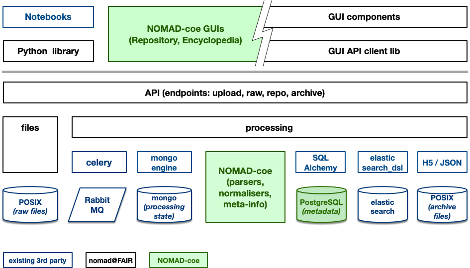
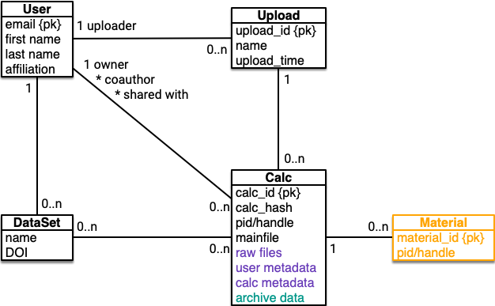
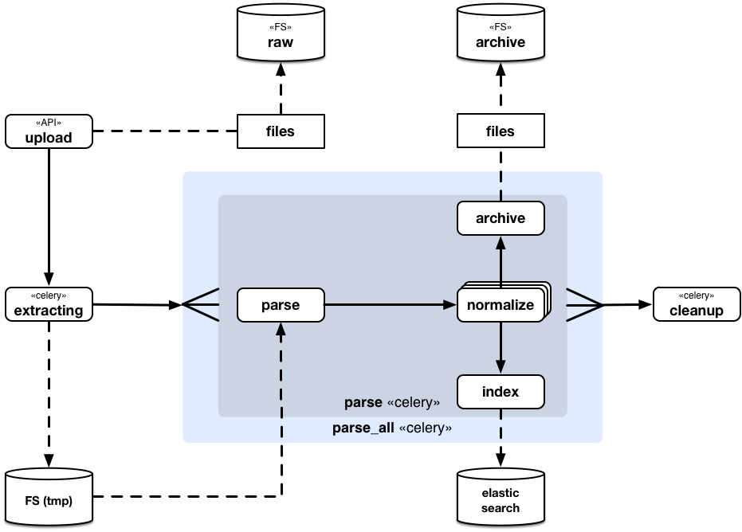

Introduction
============

Nomad xt (and NOMAD coe) is about software for storing and processing (computational)
material science data based on *big-data* and *disributed computing*.

Architecture
------------

The following depicts the *nomad-xt* architecture with respect to software compenent
in terms of python modules, gui components, and 3rd party services (e.g. databases,
search enginines, etc.)

   The main modules of nomad xt

Nomad xt uses a series of 3rd party technologies that already solve most of nomads
processing, storage, availability, and scaling goals:

minio.io
^^^^^^^^
http://minio.io is a s3 compatible object storage API that can be used in scaled in
various cloud and HPC contexts, running on a simple fily system, NAS, or actual object
storage. We use it to store uploaded files, raw repo files for download, and archive files.
Minio enables clients to downlaod and upload files via presigned URLs. This us to provide
selective secure scalable access to data files.

celery
^^^^^^
http://celeryproject.org (incl. rabbitmq, redis) is a popular combination for realizing
long running tasks in internet applications. We use it to drive the processing of uploaded files.
It allows us to transparently distribute processing load, while keeping processing state available.

elastic search
^^^^^^^^^^^^^^
Elastic search is used to store repository data (not the raw files, they are keps in minio).
Elastic search allows for flexible scalable search and analytics.

mongodb
^^^^^^^
Mongo is used to store all other user relavant data, like users, data sets, DOIs, etc.

elastic stack
^^^^^^^^^^^^^
The *elastic stack* (previously *ELK* stack) is a central logging, metrics, and monitoring
solution that collects data within the cluster and provides a flexible analytics frontend
for said data.

Data model
----------

   The main data classes in nomad xt

See :py:mod:`nomad.data` for further information.

Processing
----------

   The workflow of nomad xt processing tasks

See :py:mod:`nomad.processing` for further information.

Design principles
-----------------

- simple first, complicated only when necessary
- adopting generic established 3rd party solutions before implementing specific solutions
- only uni directional dependencies between components/modules, no circles
- only one language: Python (except, GUI of course)