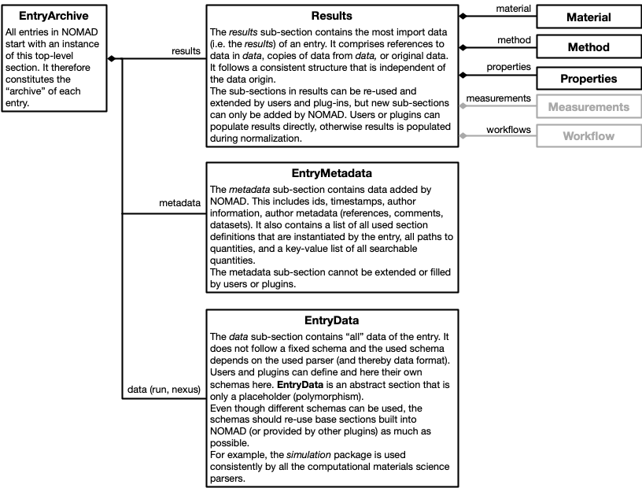

# Structured data and the NOMAD Metainfo

NOMAD structures data into **sections**, where each section can contain data and more sections.
This allows to browse complex data like you would browse files and directories on your computer.
Each section follows a **definition** and all the contained data and sub-section have a
specific name, description, possible type, shape, and unit. This means that all data follows a **schema**.
This not only helps the human exploration, but also makes it machine interpretable,
increases consistency and interoperability, enables search, APIs, visualization, and
analysis.

<figure markdown>
  
  <figcaption>Browsing structured data in the NOMAD UI (<a href="https://nomad-lab.eu/prod/v1/gui/search/entries/entry/id/zQJMKax7xk384h_rx7VW_-6bRIgi/data/run/0/system/0/atoms/positions">link</a>)</figcaption>
</figure>

## Schema language

The bases for structured data are schemas written in a **schema language**. Our
schema language is called the **NOMAD Metainfo** language. It
defines the tools to define sections, organize definitions into **packages**, and define
section properties (**sub-sections** and **quantities**).

<figure markdown>
  
  <figcaption>The NOMAD Metainfo schema language for structured data definitions</figcaption>
</figure>

Packages contain section definitions, section definitions contain definitions for
sub-sections and quantities. Sections can inherit the properties of other sections. While
sub-sections allow to define containment hierarchies for sections, quantities can
use section definitions (or other quantity definitions) as a type to define references.

If you are familiar with other schema languages and means to defined structured data
(json schema, XML schema, pydantic, database schemas, ORM, etc.), you might recognize
these concept under different names. Sections are similar to *classes*, *concepts*, *entities*, or  *tables*.
Quantities are related to *properties*, *attributes*, *slots*, *columns*.
Sub-sections might be called *containment* or *composition*. Sub-sections and quantities
with a section type also define *relationships*, *links*, or *references*.

Our guide on [how to write a schema](../schemas/basics.md) explains these concepts with an example.

## Schema

NOMAD represents many different types of data. Therefore, we cannot speak of just *the one*
schema. The entirety of NOMAD schemas is called the **NOMAD Metainfo**.
Definitions used in the NOMAD Metainfo fall into three different categories. First,
we have sections that define a **shared entry structure**. Those are independent of the
type of data (and processed file type). They allow to find all generic parts without
any deeper understanding of the specific data. Second, we have definitions of
**re-usable base sections** for shared common concepts and their properties.
Specific schemas can use and extend these base sections. Base sections define a fixed
interface or contract that can be used to build tools (e.g. search, visualizations, analysis)
around them. Lastly, there are **specific schemas**. Those re-use base sections and
complement the shared entry structure. They define specific data structures to represent
specific types of data.

<figure markdown>
  
  <figcaption>
    The three different categories of NOMAD schema definitions
  </figcaption>
</figure>

### Shared entry structure

The processed data (archive) of each entry share the same structure. They all instantiate
the same root section `EntryArchive`. They all share common sections `metadata:EntryMetadata`
and `results:Results`. They also all contain a *data* section, but the used section
definition varies depending on the type of data of the specific entry. There is the
literal `data:EntryData` sub-section. Here `EntryData` is abstract and specific entries
will use concrete definitions that inherit from `EntryData`. There are also specific *data*
sections, like `run` for simulation data and `nexus` for nexus data.

!!! attention
    The results, originally only designed for computational data, will soon be revised
    an replaced by a different section. However, the necessity and function of a section
    like this remains.

<figure markdown>
  
  <figcaption>
    All entries instantiate the same section share the same structure.
  </figcaption>
</figure>

### Base sections

Base section is a very loose category. In principle, every section definition can be
inherited from or can be re-used in different contexts. There are some dedicated (or even abstract)
base section definitions (mostly defined in the `nomad.datamodel.metainfo` package and sub-packages),
but schema authors should not strictly limit themselves to these definitions.
The goal is to re-use as much as possible and to not re-invent the same sections over
and over again. Tools build around certain base section, provide an incentive to
use them.

!!! attention
    There is no detailed how-to or reference documentation on the existing base sections
    and how to use them yet.

One example for re-usable base section is the [workflow package](../schemas/workflows.md).
These allow to define workflows in a common way. They allow to place workflows in
the shared entry structure, and the UI provides a card with workflow visualization and
navigation for all entries that have a workflow inside.

!!! attention
    Currently there are two version of the workflow schema. They are stored in two
    top-level `EntryArchive` sub-sections (`workflow` and `workflow2`). This
    will change soon to something that supports multiple workflows used in
    specific schemas and results.

### Specific schemas

Specific schemas allow users and plugin developers to describe their data in all detail.
However, users (and machines) not familiar with the specifics, will struggle to interpret
these kinda of data. Therefore, it is important to also translate (at least some of) the data
into a more generic and standardized form.

<figure markdown>
  
  <figcaption>
    From specific data to more general interoperable data.
  </figcaption>
</figure>

The **results** section provides a shared structure designed around base section definitions.
This allows you to put (at least some of) your data where it is easy to find, and in a
form that is easy to interpret. Your non-interoperable, but highly
detailed data needs to be transformed into an interoperable (but potentially limited) form.

Typically, a parser will be responsible to populate the specific schema, and the
interoperable schema parts (e.g. section results) are populated during normalization.
This allows to separate certain aspects of conversions and potentially enables re-use
for normalization routines. The necessary effort for normalization depends on how much
the specific schema deviates from base-sections. There are three levels:

- the parser (or uploaded archive file) populates section results directly
- the specific schema re-uses the base sections used for the results and normalization
can be automated
- the specific schema represents the same information differently and a translating
normalization algorithm needs to be implemented.

### Exploring the schema

All built-in definitions that come with NOMAD or one of the installed plugins can
be explored with the [Metainfo browser](https://nomad-lab.eu/prod/v1/gui/analyze/metainfo/nomad.datamodel.datamodel.EntryArchive). You can start with the root section `EntryArchive`
and browse based on sub-sections, or explore the Metainfo through packages.

To see all user provided uploaded schemas, you can use a [search for the sub-section `definition`](https://nomad-lab.eu/prod/v1/gui/search/entries?quantities=definitions).
The sub-section `definition` is a top-level `EntryArchive` sub-section. See also our
[how-to on writing and uploading schemas](http://127.0.0.1:8001/schemas/basics.html#uploading-schemas).

### Contributing to the Metainfo

The shared entry structure (including section results) is part of the NOMAD source-code.
It interacts with core functionality and needs to be highly controlled.
Contributions here are only possible through merge requests.

Base sections can be contributed via plugins. Here they can be explored in the Metainfo
browser, your plugin can provide more tools, and you can make use of normalize functions.
See also our [how-to on writing schema plugins](../plugins/schemas.md). You could
also provide base sections via uploaded schemas, but those are harder to explore and
distribute to other NOMAD installations.

Specific schemas can be provided via plugins or as uploaded schemas. When you upload
schemas, you most likely also upload data in archive files (or use ELNs to edit such files).
Here you can also provide schemas and data in the same file. In many case
specific schemas will be small and only re-combine existing base sections.
See also our
[how-to on writing schemas](http://127.0.0.1:8001/schemas/basics.html).

## Data

All processed data in NOMAD instantiates Metainfo schema definitions and the *archive* of
each entry is always an instance of `EntryArchive`. This provides an abstract structure
for all data. However, it is independent of the actual representation of data in computer memory
or how it might be stored in a file or database.

The Metainfo has many serialized forms. You can write `.archive.json` or `.archive.yaml`
files yourself. NOMAD internally stores all processed data in [message pack](https://msgpack.org/). Some
of the data is stored in mongodb or elasticsearch. When you request processed data via
API, you receive it in JSON. When you use the [ArchiveQuery](../apis/archive_query.md), all data is represented
as Python objects (see also [here](http://127.0.0.1:8001/plugins/schemas.html#starting-example)).

No matter what the representation is, you can rely on the structure, names, types, shapes, and units
defined in the schema to interpret the data.
