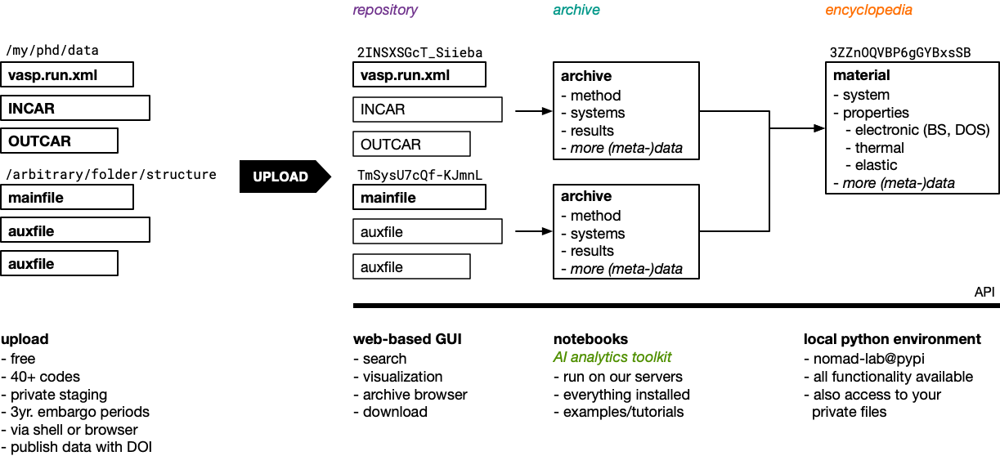

# How does NOMAD work?

## Managing data based on automatically extract rich metadata

NOMAD is based on a *bottom-up* approach. Instead of only managing data of a specific
predefined format, we use parsers and processing to support an extendable variety of
data formats. Uploaded *raw* files are analysed and files with a recognized format are parsed.
Parsers are small programs that transform data from the recognized *mainfiles* into a common machine
processable version that we call *archive*. The information in the common archive representation
drives everything else. It is the based for our search interface, the representation of materials
and their properties, as well as all analytics.

## A common hierarchical machine processable format for all data

The *archive* is a hierarchical data format with a strict schema.
All the information is organized into logical nested *sections*.
Each *section* comprised a set of *quantities* on a common subject.
All *sections* and *quantities* are supported by a formal schema that defines names, descriptions, types, shapes, and units.
We sometimes call this data *archive* and the schema *metainfo*.

## Datamodel: *uploads*, *entries*, *files*, *datasets*

Uploaded *raw* files are managed in *uploads*.
Users can create *uploads* and use them like projects.
You can share them with other users, incrementally add and modify data in them, publish (incl. embargo) them, or transfer them between NOMAD installations.
As long as an *upload* is not published, you can continue to provide files, delete the upload again, or test how NOMAD is processing your files.
Once an upload is published, it becomes immutable.

<figure markdown>
  { width=600 }
  <figcaption>NOMAD's main entities</figcaption>
</figure>

An *upload* can contain an arbitrary directory structure of *raw* files.
For each recognized *mainfile*, NOMAD creates an entry.
Therefore, an *upload* contains a list of *entries*.
Each *entry* is associated with its *mainfile*, an *archive*, and all other *auxiliary* files in the same directory.
*Entries* are automatically aggregated into *materials* based on the extract materials metadata.
*Entries* (of many uploads) can be manually curated into *datasets*for which you can also get a DOI.