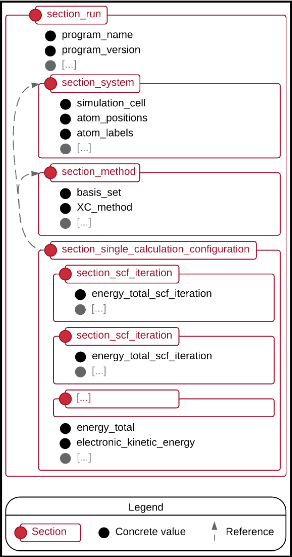

.. _metainfo-label:

NOMAD Metainfo
==============

Introduction
------------

The NOMAD Metainfo stores descriptive and structured information about materials-science
data contained in the NOMAD Archive. The Metainfo can be understood as the schema of
the Archive. The NOMAD Archive data is
structured to be independent of the electronic-structure theory code or molecular-simulation,
(or beyond). The NOMAD Metainfo can be browsed as part of the `NOMAD Repository and Archive web application <https://nomad-lab.eu/prod/rae/gui/metainfo>`_.

Typically (meta-)data definitions are generated only for a predesigned and specific scientific field,
application or code. In contrast, the NOMAD Metainfo considers all pertinent information
in the input and output files of the supported electronic-structure theory, quantum chemistry,
and molecular-dynamics (force-field) codes. This ensures a complete coverage of all
material and molecule properties, even though some properties might not be as important as
others, or are missing in some input/output files of electronic-structure programs.

NOMAD Metainfo is kept independent of the actual storage format and is not bound to any
specific storage method. In our practical implementation, we use a binary form of JSON,
called `msgpack <https://msgpack.org/>`_ on our servers and provide Archive data as JSON via
our API. For NOMAD end-users the internal storage format is of little relevance, because
the archive data is solely served by NOMAD's API.

The NOMAD Metainfo started within the `NOMAD Laboratory <https://nomad-lab.eu>`_. It was discussed at the
`CECAM workshop Towards a Common Format for Computational Materials Science Data <https://th.fhi-berlin.mpg.de/meetings/FCMSD2016/>`_
and is open to external contributions and extensions. More information can be found in
`Towards a Common Format for Computational Materials Science Data (Psi-K 2016 Highlight) <http://th.fhi-berlin.mpg.de/site/uploads/Publications/Psik_Highlight_131-2016.pdf>`_.

Metainfo Python Interface
-------------------------

.. automodule:: nomad.metainfo

Accessing the Metainfo
----------------------

Above you learned what the metainfo is and how to create metainfo definitions and work
with metainfo data in Python. But how do you get access to the existing metainfo definitions
within NOMAD? We call the complete set of all metainfo definitions the *NOMAD Metainfo*.

This *NOMAD Metainfo* comprises definitions from various packages defined by all the
parsers and converters (and respective code outputs and formats) that NOMAD supports. In
addition there are *common* packages that contain definitions that might be relevant to
different kinds of archive data.

Python
______

In the NOMAD source-code all metainfo definitions are materialized as Python source files
that contain the definitions in the format described above. If you have installed the
NOMAD Python package (see :ref:`install-client`), you can simply import the respective
Python modules:

.. code-block:: python

    from nomad.datamodel.metainfo.public import m_package
    print(m_package.m_to_json(indent=2))

    from nomad.datamodel.metainfo.public import section_run
    my_run = section_run()

Many more examples about how to read the NOMAD Metainfo programmatically can be found
`here <https://gitlab.mpcdf.mpg.de/nomad-lab/nomad-FAIR/-/tree/master/examples/access_metainfo.py>`_.

API
___

In addition, a JSON version of the NOMAD Metainfo is available through our API via the
``metainfo`` endpoint.
You can get :api:`one giant JSON with all definitions <metainfo/>`, or you
can access the metainfo for specific packages, e.g. the :api:`VASP metainfo <metainfo/vasp.json>`. The
returned JSON will also contain all packages that the requested package depends on.

Legacy metainfo version
_______________________

There are no metainfo files anymore. The old ``*.nomadmetainfo.json`` files are no
longer maintained, as the Python definitions in each parser/converter implementation are
now the normative artifact for the NOMAD Metainfo.

To get the NOMAD Metainfo in the format of the old NOMAD CoE project, you can use
the ``metainfo/legacy`` endpoint; e.g. the :api:`VASP legacy metainfo <metainfo/legacy/vasp.nomadmetainfo.json>`.
