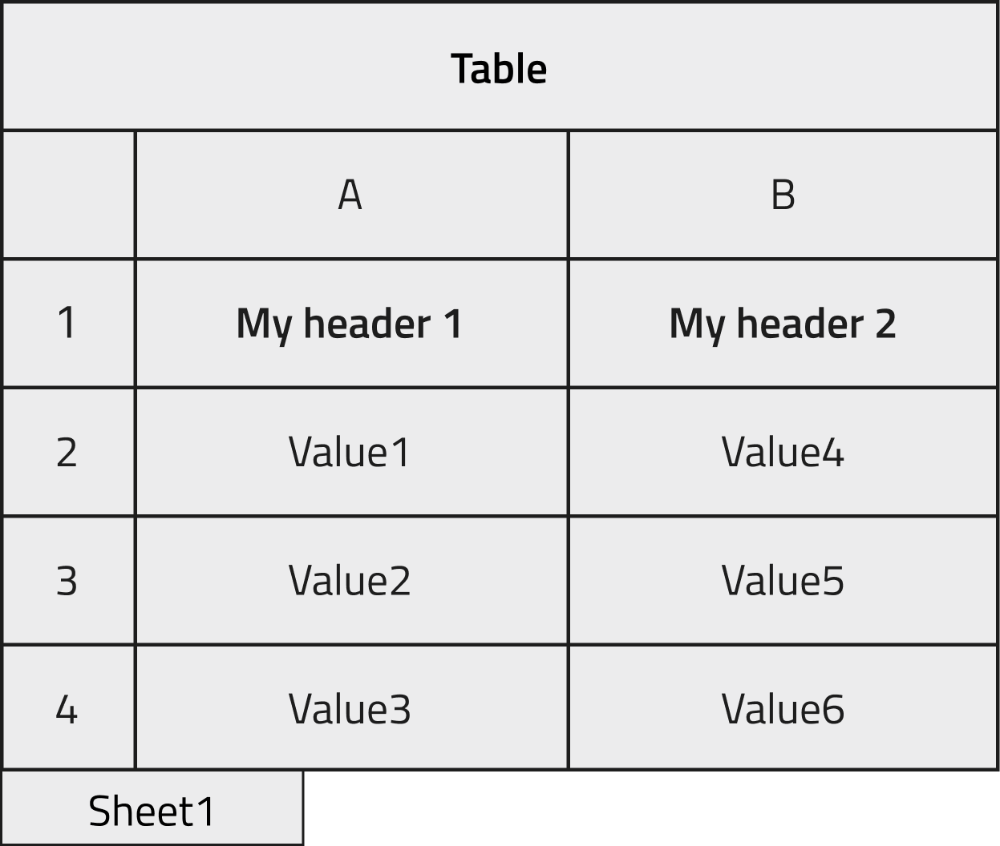
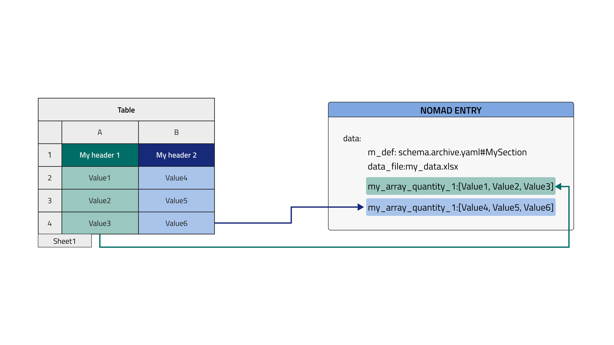
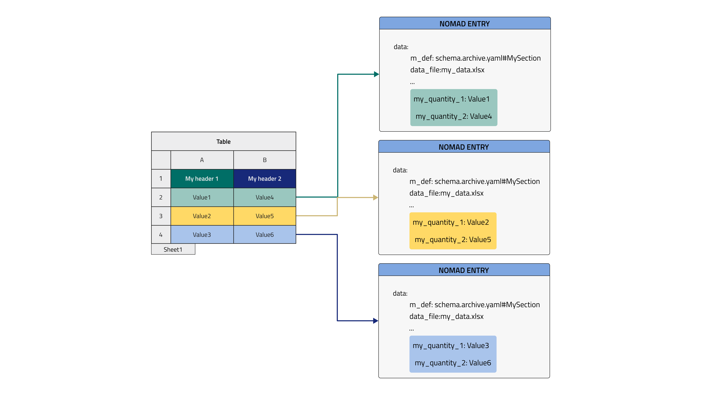

## What is a custom schema

!!! warning "Attention"

    This part of the documentation is still work in progress.

An example of custom schema written in YAML language.

```yaml
definitions:
  name: 'My test ELN'
  sections:
    MySection:
      base_sections:
       - nomad.datamodel.data.EntryData
      m_annotations:
        eln:
      quantities:
        my_array_quantity_1:
          type: str
          shape: ['*']
        my_array_quantity_2:
          type: str
          shape: ['*']
```

### The base sections

!!! warning "Attention"

    This part of the documentation is still work in progress.

### Use of YAML files

!!! warning "Attention"

    This part of the documentation is still work in progress.

### The built-in tabular parser

NOMAD provides a standard parser to import your data from a spreadsheet file (`Excel` file with .xlsx extension) or from a CSV file (a Comma-Separated Values file with .csv extension). There are several ways to parse a tabular data file into a structured [data file](../explanation/data.md#data), depending on which structure we want to give our data. Therefore, the tabular parser can be set very flexibly, directly from the [schema file](../explanation/data.md#schema) through [annotations](../howto/customization/elns.md#annotations).
In this tutorial we will focus on most common modes of the tabular parser. A complete description of all modes is given in the [Reference](../reference/annotations.md#tabular_parser) section. You can also follow the dedicated [How To](../howto/customization/tabular.md) to see practical examples of the NOMAD tabular parser, in each section you can find a commented sample schema with a step-by-step guide on how to set it to obtain the desired final structure of your parsed data.
We will make use of the tabular parser in a custom yaml schema. To obtain some structured data in NOMAD with this parser:<br />

1) the schema files should follow the NOMAD [archive files](../explanation/data.md#archive-files-a-shared-entry-structure) naming convention (i.e. `.archive.json` or `.archive.yaml` extension)<br />
2) a data file must be instantiated from the schema file<br />

   [comment]: <> (--> a link to the part upload etc should be inserted)

3) a tabular data file must be dragged in the annotated [quantity](../howto/customization/basics.md#quantities) in order for NOMAD to parse it (the quantity is called `data_file` in the following examples)

#### To be an Entry or not to be an Entry

To use this parser, three kinds of annotation must be included in the schema: `tabular`, `tabular_parser`, `label_quantity`. Refer to the dedicated [Reference](../reference/annotations.md#tabular-data) section for the full list of options.

!!! tip "important"
    The ranges of the three `mapping_options`, namely `file_mode`, `mapping_mode`, and `sections` can give rise to twelve different combinations (see table in [Reference](../reference/annotations.md#available-combinations)). It is worth to analyze each of them to understand which is the best choice to pursue from case to case.
    Some of them give rise to "not possible" data structures but are still listed for completeness, a brief explanation of why it is not possible to implement them is also provided.
    The main bring-home message is that a tabular data file can be parsed in one or more entries in NOMAD, giving rise to diverse and arbitrarily complex structures.

In the following sections, two examples will be illustrated. A [tabular data file](../howto/customization/tabular.md#preparing-the-tabular-data-file) is parsed into one or more [data archive files](../explanation/data.md#data), their structure is based on a [schema archive file](../explanation/data.md#schema). NOMAD archive files are denoted as Entries.

!!! note
    From the NOMAD point of view, a schema file and a data file are the same kind of file where different sections have been filled (see [archive files description](../explanation/data.md#archive-files-a-shared-entry-structure)). Specifically, a schema file has its `definitions` section filled while a data file will have its `data` section filled. See [How to write a schema](../howto/customization/basics.md#uploading-schemas) for a more complete description of an archive file.

#### Example 1

We want instantiate an object created from the schema already shown in the first [Tutorial section](#what-is-a-custom-schema) and populate it with the data contained in the following excel file.

<p align="center" width="100%">
    
</p>

The two columns in the file will be stored in a NOMAD Entry archive within two array quantities, as shown in the image below. In the case where the section to be filled is not in the root level of our schema but nested inside, it is useful to check the dedicated [How-to](../howto/customization/tabular.md#2-column-mode-current-entry-parse-to-my-path).

<p align="center" width="100%">
    
</p>

The schema will be decorated by the annotations mentioned at the beginning of this section  and will look like this:

```yaml
definitions:
  name: 'My test ELN'
  sections:
    MySection:
      base_sections:
       - nomad.datamodel.data.EntryData
       - nomad.parsing.tabular.TableData
      m_annotations:
        eln:
      quantities:
        data_file:
          type: str
          default: test.xlsx
          m_annotations:
            tabular_parser:
              parsing_options:
                comment: '#'
              mapping_options:
                - mapping_mode: column
                  file_mode: current_entry
                  sections:
                    - '#root'
            browser:
              adaptor: RawFileAdaptor
            eln:
              component: FileEditQuantity
        my_array_quantity_1:
          type: str
          shape: ['*']
          m_annotations:
            tabular:
              name: "My header 1"
        my_array_quantity_2:
          type: str
          shape: ['*']
          m_annotations:
            tabular:
              name: "My header 2"
```

Here the tabular data file is parsed by columns, directly within the Entry where the `TableData` is inherited and filling the quantities in the root level of the schema (see dedicated how-to to learn [how to inherit tabular parser in your schema](../howto/customization/tabular.md#inheriting-the-tabledata-base-section)).

!!! note
    In yaml files a dash character indicates a list element. `mapping_options` is a list because it is possible to parse multiple tabular sheets from the same schema with different parsing options. `sections` in turn is a list because multiple sections of the schema can be parsed with same parsing options.

#### Example 2

<p align="center" width="100%">
    
</p>

In this example, each row of the tabular data file will be placed in a new Entry that is an instance of a class defined in the schema. This would make sense for, say, an inventory spreadsheet where each row can be a separate entity such as a sample, a substrate, etc.
In this case, a manyfold of Entries will be generated based on the only class available in the schema. These Entries will not be bundled together by a parent Entry but just live in our NOMAD Upload as a spare list, to bundle them together it is useful to check the dedicated [How-to](../howto/customization/tabular.md#7-row-mode-multiple-new-entries-parse-to-my-path). They might still be referenced manually inside an overarching Entry, such as an experiment Entry, from the ELN with `ReferenceEditQuantity`.

```yaml
definitions:
  name: 'My test ELN'
  sections:
    MySection:
      base_sections:
       - nomad.datamodel.data.EntryData
       - nomad.parsing.tabular.TableData
      m_annotations:
        eln:
      more:
        label_quantity: my_quantity_1
      quantities:
        data_file:
          type: str
          default: test.xlsx
          m_annotations:
            tabular_parser:
              parsing_options:
                comment: '#'
              mapping_options:
                - mapping_mode: row
                  file_mode: multiple_new_entries
                  sections:
                    - '#root'
            browser:
              adaptor: RawFileAdaptor
            eln:
              component: FileEditQuantity
        my_quantity_1:
          type: str
          m_annotations:
            tabular:
              name: "My header 1"
        my_quantity_2:
          type: str
          m_annotations:
            tabular:
              name: "My header 2"
```

!!! warning "Attention"
    This part of the documentation is still work in progress.

## Custom normalizers

For custom schemas, you might want to add custom normalizers. All files are parsed
and normalized when they are uploaded or changed. The NOMAD metainfo Python interface
allows you to add functions that are called when your data is normalized.

Here is an example:

```python
--8<-- "examples/archive/custom_schema.py"
```

To add a `normalize` function, your section has to inherit from `ArchiveSection` which
provides the base for this functionality. Now you can overwrite the `normalize` function
and add you own behavior. Make sure to call the `super` implementation properly to
support schemas with multiple inheritance.

If we parse an archive like this:

```yaml
--8<-- "examples/archive/custom_data.archive.yaml"
```

we will get a final normalized archive that contains our data like this:

```json
{
  "data": {
    "m_def": "examples.archive.custom_schema.SampleDatabase",
    "samples": [
      {
        "added_date": "2022-06-18T00:00:00+00:00",
        "formula": "NaCl",
        "sample_id": "2022-06-18 00:00:00+00:00--NaCl"
      }
    ]
  }
}
```