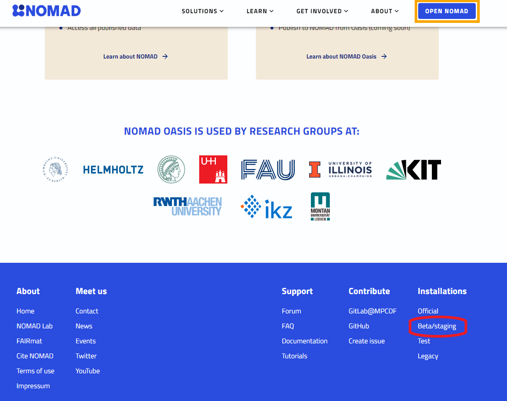
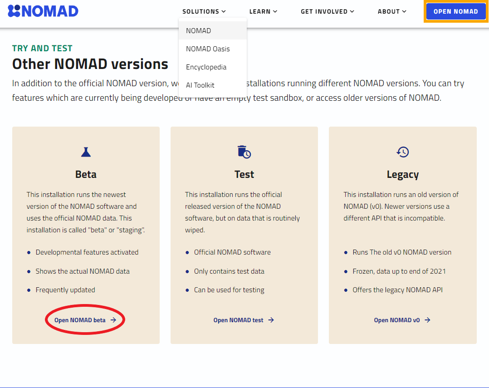

# Navigating to the NOMAD repository

There are several access points to the NOMAD repository.
The general [_landing page_](https://nomad-lab.eu/nomad-lab/){:target="_blank"} will give you a quick rundown of NOMAD's usage and features, and provides several links to documentation, tutorials, and the history behind the project.

From this page, we can navigate to the NOMAD repository, where we can upload, manage, and explore data.
There are 2 public versions available:

1. [stable](https://nomad-lab.eu/prod/v1/gui/search/entries){:target="_blank"}, which is accessed by clicking the "Open NOMAD" button at the top of the landing page (highlighted orange in images below).
2. [beta /staging](https://nomad-lab.eu/prod/v1/staging/gui/search/entries){:target="_blank"}, which has the latest release and updates much more frequently, but may also harbor unstable or untested features. You can navigate to this version via two distinct links: 1. at the bottom-right corner of the landing page and 2. under "SOLUTIONS" > "NOMAD" > "Try and Test" in the top navigation menu (highlighted red in images below).

{.screenshot}
{.screenshot}

